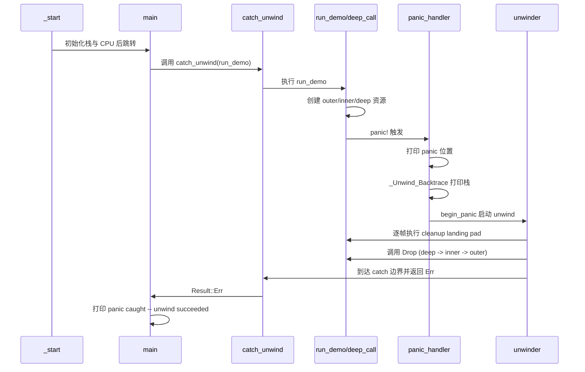

# AArch64 Bare-metal Unwind Demo 详解

本文解释当前 demo 中最容易混淆的几个点：

- catch_unwind 是做什么的
- run_demo 什么时候执行
- panic_handler 什么时候执行
- run_demo 是否在 panic_handler 中执行
- panic 发生后，unwind 到底做了什么

对应源码文件：src/main.rs

---

## 1. 先给结论

1. `run_demo` 是由 `main` 通过 `catch_unwind(run_demo)` 调用的。
2. `panic_handler` 只在 `panic!()` 触发后才会进入。
3. `run_demo` 不在 `panic_handler` 中执行。顺序是：先执行 `run_demo`，中途 panic，再进入 `panic_handler`。
4. `catch_unwind` 是“外层保护边界”：它把 panic unwinding 的结果转成 `Result`，避免整个程序直接终止。

---

## 2. 调用关系图（结构图）

```mermaid
flowchart TD
    S[_start] --> M[main]
    M --> C[catch_unwind(run_demo)]
    C --> R[run_demo]
    R --> D2[deep_call(2)]
    D2 --> D1[deep_call(1)]
    D1 --> D0[deep_call(0)]
    D0 --> P[panic!]
    P --> H[panic_handler]
    H --> B[print_backtrace]
    H --> BP[begin_panic]
    BP --> U[Unwinder walks stack]
    U --> DR1[Drop deep resource]
    U --> DR2[Drop inner resource]
    U --> DR3[Drop outer resource]
    U --> CATCH[catch_unwind catches panic]
    CATCH --> MR{match result}
    MR -->|Err| OK[print panic caught]
    MR -->|Ok| UNEXP[print unexpected return]
```

---

## 3. 时序图（真正执行顺序）



---

## 4. main 中到底发生了什么

`main` 的关键逻辑可以抽象为：

```rust
let result = unwinding::panic::catch_unwind(run_demo);
match result {
    Ok(_) => { /* 正常返回（这个 demo 里通常不会发生） */ }
    Err(_) => { /* 说明 panic 被成功 unwind 并捕获 */ }
}
```

含义：

- `catch_unwind` 会执行 `run_demo`。
- 如果 `run_demo` 过程中没有 panic，则返回 `Ok`。
- 如果 `run_demo` panic 并且 unwinding 成功传播到这里，则返回 `Err`。

---

## 5. run_demo 和 panic_handler 的关系

很多人会误解这里。

实际关系是：

1. 先执行 `run_demo`
2. `run_demo` 内部调用 `deep_call`
3. `deep_call(0)` 触发 `panic!`
4. 才进入 `panic_handler`

所以：

- `run_demo` 不是在 `panic_handler` 里执行。
- `panic_handler` 是 panic 之后由运行时接管的路径。

---

## 6. panic_handler 在做什么

当前 demo 里的 `panic_handler` 分三步：

1. 打印 panic 位置（文件、行号）
2. 调用 `_Unwind_Backtrace` 打印调用栈 IP
3. 调用 `unwinding::panic::begin_panic(...)` 启动 Itanium ABI unwinding

注意：

- `begin_panic` 不是简单死循环，它会真正触发栈展开。
- 如果展开失败，代码会走到 handler 后半段并打印失败信息后停机。

---

## 7. unwind 过程（详细）

可以把 unwind 理解为“异常驱动的栈回退 + 清理执行”：

1. 产生异常对象
- `begin_panic` 构造 panic payload 并进入 unwinder。

2. 读取 unwind 元数据
- unwinder 根据当前 PC 在 `.eh_frame` 中找到对应 FDE/CIE。
- 这些信息告诉 unwinder 如何恢复上层栈帧寄存器。

3. personality 决策
- 对每一帧，personality 结合 LSDA 判断：
  - 是否有 cleanup（Drop）要执行
  - 是否是可捕获边界

4. 执行 cleanup landing pad
- 对应 Rust 语义就是依次执行离开作用域对象的 `Drop`。
- 所以你看到输出顺序是：deep 资源先释放，再 inner，再 outer。

5. 命中 catch 边界
- 展开到 `catch_unwind` 的边界时，panic 被“接住”，转成 `Result::Err`。

6. 程序继续运行
- `main` 拿到 `Err` 后打印“panic caught -- unwind succeeded”，然后进入结尾循环。

---

## 8. 为什么这个 demo 可以证明 unwind 真的成功

判断标准不是“看到了 panic 文本”，而是以下证据链同时成立：

1. panic 位置信息被打印
2. backtrace 被打印（说明 unwind ABI 路径在工作）
3. 多个作用域对象的 Drop 顺序打印（说明 cleanup landing pad 被执行）
4. `catch_unwind` 返回 Err（说明 panic 没有直接终止程序，而是被外层捕获）

四项同时出现，才说明：

- panic 发生了
- unwind 真跑了
- 资源回收真执行了
- catch 真生效了

---

## 9. 常见误区

- 误区 1：`catch_unwind` 会阻止 panic_handler 执行
  - 错。panic 先进入 panic_handler，之后由 begin_panic 触发 unwind，再回到 catch 边界。

- 误区 2：`run_demo` 在 panic_handler 里调用
  - 错。是 main -> catch_unwind -> run_demo 的正常调用路径。

- 误区 3：看到 panic 文本就代表 unwind 完成
  - 错。必须看到 Drop 和 catch 结果才能确认完整闭环。

---

## 10. 建议的阅读顺序

1. 先看 `main`（理解外层控制边界）
2. 再看 `run_demo/deep_call`（理解 panic 触发点）
3. 再看 `panic_handler`（理解 panic 后转入 unwind）
4. 最后对照串口输出，把每一行映射回函数路径

这样看最不容易乱。
