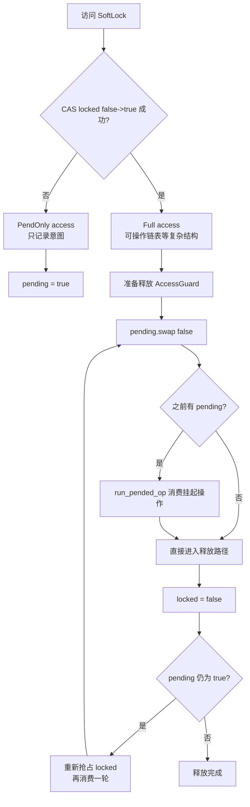
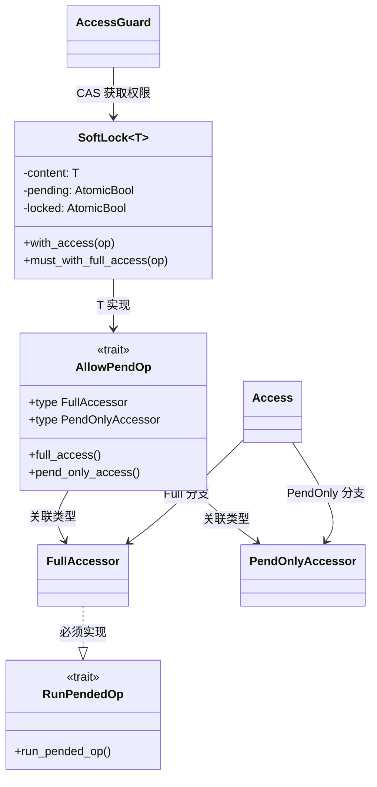
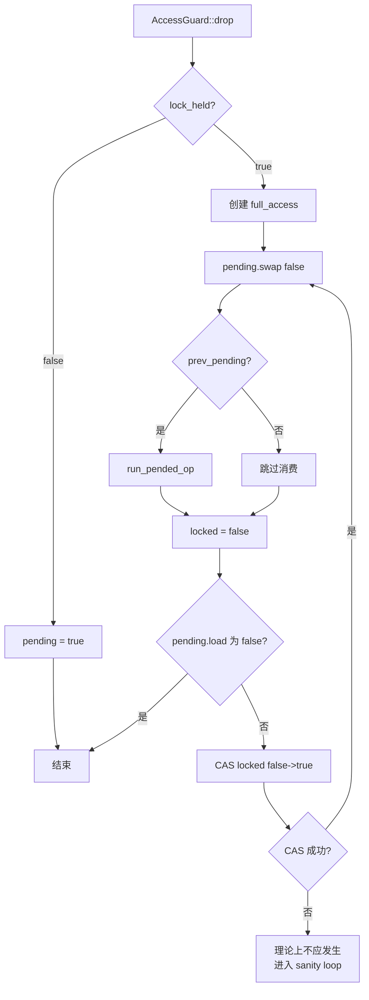
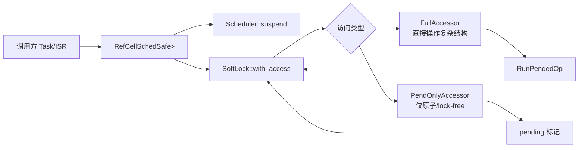
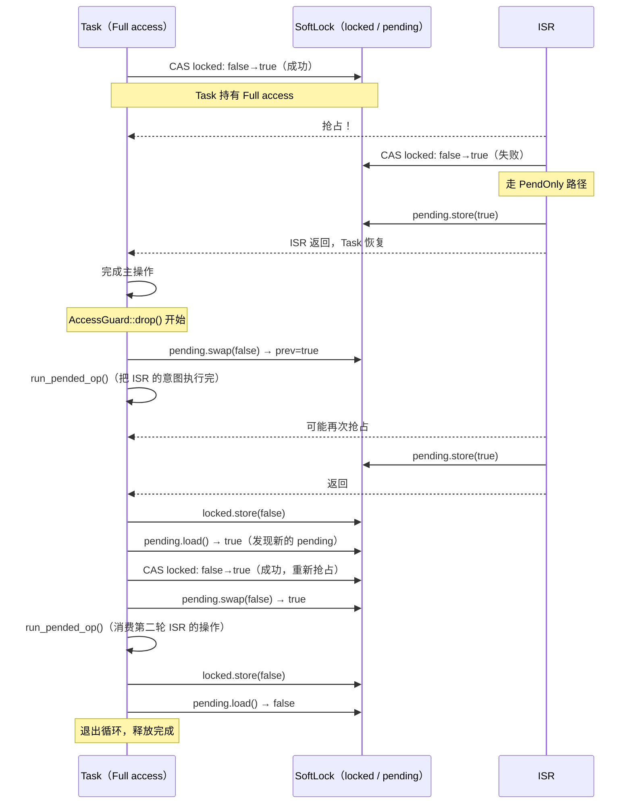

# Hopter Soft-Lock 机制详细分析

> 目标板：Cortex-M（ARMv6-M / ARMv7E-M），RTOS：Hopter。
> Soft-Lock 是 Hopter 实现**零延迟 IRQ 处理**的核心同步原语。

---

## 目录

1. [设计动机：为什么不能禁中断](#1-设计动机为什么不能禁中断)
2. [核心 Trait 体系](#2-核心-trait-体系)
3. [SoftLock 数据结构](#3-softlock-数据结构)
4. [访问权的获取：AccessGuard](#4-访问权的获取accessguard)
5. [Full 访问路径](#5-full-访问路径)
6. [PendOnly 访问路径](#6-pendonly-访问路径)
7. [释放时的 pending 操作消费循环](#7-释放时的-pending-操作消费循环)
8. [竞态窗口分析与正确性论证](#8-竞态窗口分析与正确性论证)
9. [外层包装：RefCellSchedSafe](#9-外层包装refcellschedsafe)
10. [四个使用实例详析](#10-四个使用实例详析)
11. [与传统临界区的对比](#11-与传统临界区的对比)

---

## 1. 设计动机：为什么不能禁中断

传统 RTOS 保护共享数据的方法是关中断（critical section）：进入临界区时 `PRIMASK = 1`，离开时 `PRIMASK = 0`。这种方法简单可靠，但有一个固有代价：**在临界区内，所有 IRQ 都被阻塞**。

Hopter 的设计目标是**零延迟 IRQ 处理**（Zero-Latency IRQ Handling）——内核在任何时刻都不主动关中断。`lib.rs` 的模块注释明确说明：

> "The kernel never disables IRQs, not even in the parts that are traditionally considered as critical sections. This ensures that pending interrupts are handled immediately. A novel synchronization primitive, called soft-lock, manages concurrent access between IRQs and tasks without the need to disable IRQs."

Soft-Lock 的核心思路是：**不阻止 ISR 进入，而是根据"是否有人正在持有全量访问权"来决定 ISR 能做什么**。

### 1.1 高层工作流程图



---

## 2. 核心 Trait 体系

Soft-Lock 建立在三个 trait 的协作上：

### 2.1 `AllowPendOp<'a>`（`sync/soft_lock.rs`）

被 `SoftLock<T>` 保护的类型 `T` 必须实现此 trait：

```rust
pub(crate) trait AllowPendOp<'a> {
    type FullAccessor: RunPendedOp + 'a;
    type PendOnlyAccessor: 'a;

    fn full_access(&'a self) -> Self::FullAccessor;
    fn pend_only_access(&'a self) -> Self::PendOnlyAccessor;
}
```

**语义**：`T` 必须提供两种视角：
- `FullAccessor`：拥有全量访问权时的视图，可以读写所有字段，可以执行所有操作
- `PendOnlyAccessor`：只能 pend（挂起操作意图）时的视图，通常只允许操作原子计数器或无锁队列

两种 accessor 的权限差异是 soft-lock 机制的关键设计点。

### 2.2 `RunPendedOp`（`sync/soft_lock.rs`）

`FullAccessor` 必须实现此 trait：

```rust
pub(crate) trait RunPendedOp {
    fn run_pended_op(&mut self);
}
```

**语义**：当全量访问权的持有者即将释放锁时，它必须负责把之前 ISR 挂起的操作真正执行完。

### 2.3 访问模式枚举 `Access`

```rust
pub(crate) enum Access<FullAccessor, PendOnlyAccessor>
where
    FullAccessor: RunPendedOp,
{
    Full { full_access: FullAccessor },
    PendOnly { pend_access: PendOnlyAccessor },
}
```

调用方用 `match` 处理两种情况，编译器保证不会遗漏。

### 2.4 Trait 与对象关系图



---

## 3. SoftLock 数据结构

```rust
pub(crate) struct SoftLock<T>
where
    for<'b> T: AllowPendOp<'b>,
{
    content: T,
    pending: AtomicBool,  // 是否有尚未处理的 pended 操作
    locked: AtomicBool,   // 是否有 FullAccessor 正在活跃
}
```

**两个原子标志的语义**：

| 字段 | 值 | 含义 |
|------|----|----|
| `locked` | `false` | 当前没有人持有全量访问权，下一个请求者可以成为持有者 |
| `locked` | `true` | 已有人持有全量访问权，新请求者只能获得 pend-only 访问 |
| `pending` | `false` | 没有待处理的 pended 操作 |
| `pending` | `true` | 有 ISR 曾以 pend-only 方式记录了意图，需要全量访问者执行 |

```rust
impl<T> SoftLock<T>
where
    for<'b> T: AllowPendOp<'b>,
{
    pub(crate) fn with_access<'a, F, R>(&'a self, op: F) -> R { ... }
    pub(crate) fn must_with_full_access<'a, F, R>(&'a self, op: F) -> R { ... }
}
```

- `with_access`：根据当前 `locked` 状态，给调用者 `Full` 或 `PendOnly` access
- `must_with_full_access`：必须拿到 `Full` access，拿不到则**自旋等待**（死循环）

---

## 4. 访问权的获取：AccessGuard

```rust
struct AccessGuard<'a, T>
where
    for<'b> T: AllowPendOp<'b>,
{
    lock_held: bool,              // true = Full access，false = PendOnly access
    soft_lock: &'a SoftLock<T>,
}

impl<'a, T> AccessGuard<'a, T> {
    fn guard(soft_lock: &'a SoftLock<T>) -> Self {
        Self {
            lock_held: soft_lock
                .locked
                .compare_exchange(false, true, Ordering::SeqCst, Ordering::SeqCst)
                .is_ok(),
            soft_lock,
        }
    }
}
```

构造 `AccessGuard` 时，尝试用 **CAS（compare-and-exchange）** 把 `locked` 从 `false` 改成 `true`：
- **成功**：`lock_held = true`，获得全量访问权
- **失败**（已有人持有）：`lock_held = false`，只获得 pend-only 访问

这是整个机制的**唯一入口点**，一次原子操作决定本次访问的权限级别。

```rust
fn get_access(&self) -> Access<...> {
    match self.lock_held {
        true  => Access::Full     { full_access:  self.soft_lock.content.full_access()      },
        false => Access::PendOnly { pend_access:  self.soft_lock.content.pend_only_access() },
    }
}

fn must_get_full_access(&self) -> <T as AllowPendOp>::FullAccessor {
    match self.lock_held {
        true  => self.soft_lock.content.full_access(),
        false => loop {},   // 自旋
    }
}
```

---

## 5. Full 访问路径

当 `lock_held = true` 时，调用者持有全量访问权，可以通过 `FullAccessor` 读写被保护的所有字段，执行所有操作。

**典型用途（以就绪队列为例）**：

```rust
// scheduler.rs - 从就绪队列中取出最高优先级的任务
READY_TASK_QUEUE.with_suspended_scheduler(|queue, sched_guard| {
    queue.must_with_full_access(|full_access| {
        let mut locked_list = full_access.ready_linked_list.lock_now_or_die();
        let next_task = locked_list.pop_highest_priority().unwrap_or_die();
        // ... 设置新任务为当前任务
    })
});
```

```rust
// scheduler.rs - 往就绪队列中插入新任务（Full 路径）
Access::Full { full_access } => {
    task.set_state(TaskState::Ready);
    let mut locked_list = full_access.ready_linked_list.lock_now_or_die();
    locked_list.push_back(task);
}
```

持有 Full access 的代码逻辑上相当于进入了"临界区"，可以安全地操作链表等非原子数据结构。但注意：**这不是通过禁中断实现的，ISR 此时仍然可以运行**，只是 ISR 会从 CAS 失败路径走，拿到 PendOnly access。

---

## 6. PendOnly 访问路径

当 `lock_held = false` 时，调用者（通常是 ISR）只能通过 `PendOnlyAccessor` 操作被保护的数据。`PendOnlyAccessor` 暴露的字段通常是无锁的原子变量或 lock-free 队列，允许并发读写。

**原则**：PendOnly 操作只需记录"意图"，不需要立即执行复杂的结构变更。

**三个使用实例的 PendOnly 操作对比**：

| 使用场景 | PendOnly 操作 | 说明 |
|----------|--------------|------|
| 就绪队列（`scheduler.rs`）| `insert_buffer.enqueue(task)` | 把 `Arc<Task>` 放入无锁环形缓冲区 |
| 等待队列（`wait_queue.rs`）| `notify_cnt.fetch_add(1)` | 原子递增通知计数 |
| Mailbox（`mailbox.rs`）| `pending_count.fetch_add(1)` | 原子递增挂起计数 |
| 睡眠队列（`time/mod.rs`）| `delete_buffer.enqueue(task)` 或 `time_to_wakeup.store(true)` | 放入删除缓冲区或设置唤醒标志 |

所有 PendOnly 操作都是**原子的、无锁的、不依赖对方的任何状态**——放入缓冲区或递增计数器，绝不需要读取链表或修改复杂结构。

---

## 7. 释放时的 pending 操作消费循环

这是 soft-lock 机制里**最精妙也最微妙**的部分。`AccessGuard` 的 `drop` 实现：

```rust
impl<'a, T> Drop for AccessGuard<'a, T>
where
    for<'b> T: AllowPendOp<'b>,
{
    fn drop(&mut self) {
        match self.lock_held {
            // ── Full access 持有者释放时 ──────────────────────────────
            true => {
                let mut full_access = self.soft_lock.content.full_access();

                loop {
                    // ① 检查 pending 标志，并原子清零
                    let prev_pending = self.soft_lock.pending.swap(false, Ordering::SeqCst);

                    // ② 如果有 pended 操作，执行之
                    if prev_pending {
                        full_access.run_pended_op();
                    }

                    // *** ← ISR 可能在这里抢占并再次设 pending ***

                    // ③ 释放 locked 标志
                    self.soft_lock.locked.store(false, Ordering::SeqCst);

                    // ④ 再次检查 pending；若已清零则退出
                    if !self.soft_lock.pending.load(Ordering::SeqCst) {
                        break;
                    } else {
                        // ⑤ 还有新的 pending，重新抢占 locked 标志，再循环一次
                        let res = self.soft_lock.locked.compare_exchange(
                            false, true, Ordering::SeqCst, Ordering::SeqCst,
                        );
                        if res.is_err() {
                            loop {}; // 不应发生，sanity check
                        }
                    }
                }
            }
            // ── PendOnly 访问者完成时 ──────────────────────────────────
            false => {
                self.soft_lock.pending.store(true, Ordering::SeqCst);
            }
        }
    }
}
```

### 步骤拆解

**PendOnly 释放（简单）**：
- 设置 `pending = true`，告知 Full access 持有者"我记录了意图"
- 不做任何其他事

**Full access 释放（复杂的消费循环）**：

```
loop:
  ① pending.swap(false)   ← 原子地"领取" pending 状态
  ② if prev_pending → run_pended_op()   ← 执行挂起的操作

  *** ISR 可能在这里抢占，设 pending = true ***

  ③ locked.store(false)   ← 释放锁

  ④ if !pending → break   ← 没有新的 pending，安全退出
     else:
  ⑤ locked.compare_exchange(false → true)   ← 重新抢占锁
     goto loop                               ← 再次消费
```

### 7.1 `drop` 消费循环流程图



---

## 8. 竞态窗口分析与正确性论证

注释中专门标注了一个关键竞态窗口：

```
// *** ISR might set pending again here. ***
```

即：在步骤 ② 完成（执行完 pended 操作）之后、步骤 ③ 释放锁之前，一个 ISR 可以抢占并设置 `pending = true`。

### 可能的执行序列

```
Task（Full 持有者）                 ISR

① pending.swap(false) → prev=true
② run_pended_op()                   （ISR 尚未抢占）
                                    抢占！
                                    CAS locked: false→true 失败（locked 仍为 true）
                                    → 走 PendOnly 路径
                                    → pending.store(true)
                                    返回 Task
③ locked.store(false)
④ pending.load() → true             （发现新的 pending）
⑤ CAS locked: false→true 成功
   loop: ① pending.swap(false) → prev=true
   ② run_pended_op()              ← 消费 ISR 挂起的操作
   ③ locked.store(false)
   ④ pending.load() → false
   break
```

### 为什么④必须在③之后检查？

如果把顺序改成"先 `locked = false`，再 `pending = false`"，会出现漏掉通知的问题：

```
（错误的顺序）
① pending.swap(false) → true
② run_pended_op()
③ pending.load() → false  ← ISR 可能在这里抢占并设 pending=true！
④ locked.store(false)     ← 此时已 break，pending 的操作永远不会被处理
```

正确顺序（先清 `pending`，再释放 `locked`，再检查 `pending`）保证了：
- 若 ISR 在步骤③之前抢占：ISR 拿不到 Full access（`locked=true`），写 `pending=true`，Task 在步骤④检查到并重新循环
- 若 ISR 在步骤③之后抢占：这次 ISR 拿到了 Full access，自己处理操作，不设 `pending`
- 无论哪种情况，**没有操作会永久丢失**

### 整体正确性的关键约束

注释中明确说明：

> "Important Note: The wrapper assumes that the preempting thread of execution always finishes before returning to the preempted thread of execution, which is the case for ISRs, but not the case for task context switching in general."

Soft-Lock 的正确性依赖一个前提：**抢占方（ISR）一定在被抢占方恢复之前完成**。这在 Cortex-M 的 ISR 中天然成立（异常返回机制保证），但对两个普通任务不成立（任意切换）。因此 Soft-Lock 只解决 **任务 vs ISR** 的并发问题，不是通用的多核锁。

---

## 9. 外层包装：RefCellSchedSafe

实际使用中，`SoftLock<T>` 总是被包在 `RefCellSchedSafe` 里：

```rust
type ReadyQueue = RefCellSchedSafe<SoftLock<Inner>>;

static READY_TASK_QUEUE: ReadyQueue = RefCellSchedSafe::new(SoftLock::new(Inner::new()));
```

`RefCellSchedSafe` 的定义：

```rust
pub(crate) struct RefCellSchedSafe<T: ?Sized> {
    val: T,
}

impl<T> RefCellSchedSafe<T> {
    pub(crate) fn with_suspended_scheduler<F, R>(&self, op: F) -> R
    where
        F: FnOnce(&T, &SchedSuspendGuard) -> R,
    {
        let guard = Scheduler::suspend();
        op(&self.val, &guard)
    }
}
```

访问内部数据时，调度器会被暂停（`SUSPEND_CNT++`）。`SchedSuspendGuard` 在 drop 时恢复调度器，若此时有 pending 的上下文切换请求（`PENDING_CTXT_SWITCH = true`），会立即触发。

**两层保护的分工**：

| 层级 | 机制 | 保护对象 |
|------|------|----------|
| `RefCellSchedSafe` | 暂停调度器 | 防止同一核上的两个任务并发访问（Rust 的 `RefCell` 语义升级版） |
| `SoftLock` | CAS 原子操作 | 区分"任务持有 Full access 期间 ISR 抢占"的情况 |

### 9.1 外层包装关系图



**注意**：暂停调度器不等于禁中断。ISR 仍然可以抢占并用 PendOnly 路径写入数据。

---

## 10. 四个使用实例详析

### 10.1 调度器就绪队列（`schedule/scheduler.rs`）

**数据结构**：

```rust
struct Inner {
    insert_buffer: MpMcQueue<Arc<Task>, MAX_TASK_NUMBER>,  // lock-free 缓冲区
    ready_linked_list: Spin<LinkedList<TaskListAdapter>>,   // 优先级链表
}

struct InnerFullAccessor<'a> {
    insert_buffer: &'a InsertBuffer,
    ready_linked_list: &'a Spin<LinkedList<TaskListAdapter>>,
}

struct InnerPendAccessor<'a> {
    insert_buffer: &'a InsertBuffer,  // 只暴露 lock-free 缓冲区
}
```

**pend 操作**（ISR 路径）：把 `Arc<Task>` 放入 `insert_buffer`（lock-free MPMC 队列）

**run_pended_op**（任务路径）：把 `insert_buffer` 中所有 task 取出，链入 `ready_linked_list`

```rust
impl<'a> RunPendedOp for InnerFullAccessor<'a> {
    fn run_pended_op(&mut self) {
        current::with_cur_task(|cur_task| {
            let mut locked_list = self.ready_linked_list.lock_now_or_die();
            while let Some(task) = self.insert_buffer.dequeue() {
                if task.should_preempt(cur_task) {
                    PENDING_CTXT_SWITCH.store(true, Ordering::SeqCst);
                }
                task.set_state(TaskState::Ready);
                locked_list.push_back(task);
            }
        })
    }
}
```

**典型使用场景**：ISR 触发某个任务就绪（如 DMA 完成中断），此时调度器的就绪队列可能正被某个任务操作，ISR 把任务放入 `insert_buffer`，当操作队列的任务释放时就会把缓冲区内容消费进链表。

---

### 10.2 等待队列（`sync/wait_queue.rs`）

**数据结构**：

```rust
struct Inner {
    queue: Spin<LinkedList<TaskListAdapter>>,  // 阻塞任务链表
    notify_cnt: AtomicUsize,                  // 挂起通知计数
}

struct InnerPendAccessor<'a> {
    notify_cnt: &'a AtomicUsize,  // 只允许递增计数
}
```

**pend 操作**（ISR 路径）：`notify_cnt.fetch_add(1)`——记录"我想唤醒一个任务"

**run_pended_op**（任务路径）：把 `notify_cnt` 里累积的计数，转化为对应次数的任务唤醒操作

```rust
impl<'a> RunPendedOp for InnerFullAccessor<'a> {
    fn run_pended_op(&mut self) {
        let mut locked_queue = self.queue.lock_now_or_die();
        let cnt = self.notify_cnt.swap(0, Ordering::SeqCst);
        for _ in 0..cnt {
            if let Some(task) = locked_queue.pop_highest_priority() {
                Scheduler::accept_task(task);
            } else {
                break;
            }
        }
    }
}
```

**notify_one_allow_isr** 同时处理两种路径：

```rust
pub(super) fn notify_one_allow_isr(&self) {
    self.inner.with_suspended_scheduler(|queue, _| {
        queue.with_access(|access| match access {
            Access::Full { full_access } => {
                // ISR 或任务直接操作链表
                if let Some(task) = full_access.queue.pop_highest_priority() {
                    Scheduler::accept_task(task);
                }
            }
            Access::PendOnly { pend_access } => {
                // ISR 只能递增计数
                pend_access.notify_cnt.fetch_add(1, Ordering::SeqCst);
            }
        })
    });
}
```

---

### 10.3 Mailbox（`sync/mailbox.rs`）

Mailbox 是更高层的同步原语，只允许一个任务等待，允许多个生产者通知。

**数据结构**：

```rust
struct Inner {
    count: AtomicUsize,          // 正式通知计数（任务可以消耗）
    pending_count: AtomicUsize,  // ISR 路径的临时通知计数
    wait_task: Spin<WaitTask>,   // 当前等待的任务（含超时/无超时两种）
    task_notified: AtomicBool,   // 用于区分"通知唤醒"vs"超时唤醒"
}

struct InnerPendAccessor<'a> {
    pending_count: &'a AtomicUsize,  // 只暴露临时计数
}
```

**pend 操作**（ISR 路径）：`pending_count.fetch_add(1)`

**run_pended_op**（任务路径）：把 `pending_count` 转移到 `count`，并唤醒等待任务

```rust
impl<'a> RunPendedOp for InnerFullAccessor<'a> {
    fn run_pended_op(&mut self) {
        // 原子 swap 避免读-加-写竞争
        let pending_count = self.pending_count.swap(0, Ordering::SeqCst);
        self.count.fetch_add(pending_count, Ordering::SeqCst);

        // 唤醒等待任务（如有）
        match self.wait_task.lock_now_or_die().take() {
            WaitTask::WithTimeout(task) => {
                time::remove_task_from_sleep_queue_allow_isr(task);
                self.count.fetch_sub(1, Ordering::SeqCst);
                self.task_notified.store(true, Ordering::SeqCst);
            }
            WaitTask::WithoutTimeout(task) => {
                Scheduler::accept_task(task);
                self.count.fetch_sub(1, Ordering::SeqCst);
            }
            WaitTask::NoTask => {}
        }
    }
}
```

`swap(0)` 而不是 `load + store` 的原因：若在 `load` 和 `store` 之间有 ISR 再次递增 `pending_count`，`store(0)` 会覆盖掉这个增量，导致通知丢失。原子 `swap` 保证领取的是一个确定的值。

**notify_allow_isr** 的 Full 路径直接操作 `wait_task`，可以立即唤醒等待任务；PendOnly 路径只修改 `pending_count`，等稍后 Full 持有者的 `run_pended_op` 再唤醒。

---

### 10.4 睡眠队列（`time/mod.rs`）

**数据结构**：

```rust
struct Inner {
    time_sorted_queue: Spin<LinkedList<TaskListAdapter>>,  // 按唤醒时刻排序的链表
    delete_buffer: MpMcQueue<Arc<Task>, MAX_TASK_NUMBER>,  // 删除缓冲区
    time_to_wakeup: AtomicBool,                           // 是否有任务到期需唤醒
}

struct InnerPendAccessor<'a> {
    delete_buffer: &'a DeleteBuffer,
    time_to_wakeup: &'a AtomicBool,
}
```

**场景一：ISR 触发定时唤醒**（SysTick handler 调用 `wake_sleeping_tasks`）

```rust
pub(crate) fn wake_sleeping_tasks() {
    SLEEP_TASK_QUEUE.with_suspended_scheduler(|queue, _| {
        queue.with_access(|access| match access {
            Access::Full { full_access } => {
                full_access.wake_expired_tasks();  // 直接扫描链表
            }
            Access::PendOnly { pend_access } => {
                pend_access.time_to_wakeup.store(true, Ordering::SeqCst);  // 设标志
            }
        })
    });
}
```

**场景二：Mailbox 超时，需要从睡眠队列中移除任务**（`remove_task_from_sleep_queue_allow_isr`）

```rust
pub(crate) fn remove_task_from_sleep_queue_allow_isr(task: Arc<Task>) {
    SLEEP_TASK_QUEUE.with_suspended_scheduler(|queue, _| {
        queue.with_access(|access| match access {
            Access::Full { full_access } => {
                // 直接从链表移除
                if let Some(task) = full_access.time_sorted_queue.remove_task(&task) {
                    Scheduler::accept_task(task);
                }
            }
            Access::PendOnly { pend_access } => {
                // 放入删除缓冲区，留给 Full 持有者处理
                pend_access.delete_buffer.enqueue(task).unwrap_or_die();
            }
        })
    });
}
```

**run_pended_op**（Full 持有者消费时）：

```rust
impl<'a> RunPendedOp for InnerFullAccessor<'a> {
    fn run_pended_op(&mut self) {
        if self.time_to_wakeup.load(Ordering::SeqCst) {
            self.wake_expired_tasks();
            self.time_to_wakeup.store(false, Ordering::SeqCst);
        }
        // wake_expired_tasks 内部也会消费 delete_buffer
    }
}

fn wake_expired_tasks(&self) {
    let cur_tick = TICKS.load(Ordering::SeqCst);
    let mut locked_queue = self.time_sorted_queue.lock_now_or_die();
    
    // 唤醒所有到期任务
    let mut cursor_mut = locked_queue.front_mut();
    while let Some(task) = cursor_mut.get() {
        if tick_cmp(task.get_wake_tick(), cur_tick) != Greater {
            let task = cursor_mut.remove().unwrap_or_die();
            Scheduler::accept_task(task);
        } else {
            break;
        }
    }
    
    // 处理 delete_buffer（ISR 路径放入的待删除任务）
    while let Some(task) = self.delete_buffer.dequeue() {
        if let Some(task) = locked_queue.remove_task(&task) {
            Scheduler::accept_task(task);
        }
    }
}
```

---

## 11. 与传统临界区的对比

### 11.1 传统关中断方案

```
任务 (critical section)：
  PRIMASK = 1         ← 关闭所有中断
  操作共享数据
  PRIMASK = 0         ← 恢复中断
```

**问题**：在临界区内产生的中断（硬件事件、传感器数据、通信帧）需要等到临界区结束才能被处理，平均延迟 = 临界区长度 / 2。临界区越长延迟越大。

### 11.2 Soft-Lock 方案

```
任务（Full access）：         ISR（PendOnly access）：
  CAS locked: false→true       CAS locked: false→true → 失败
  操作共享数据（链表等）        → PendOnly: 只写原子/lockfree 字段
  释放：检查 pending            pending.store(true)    ← 立即返回！
       执行 pended 操作
  locked.store(false)
```

ISR 在**任何时刻都立即返回**：不需要等任务释放锁，不被延迟。ISR 的"操作"只是放一个原子值，耗时可以忽略。

### 11.3 量化对比

| 特性 | 传统关中断 | Soft-Lock |
|------|-----------|-----------|
| IRQ 最大延迟 | = 临界区长度 | ≈ 0（PendOnly 操作 = 几条原子指令）|
| ISR 中操作共享数据 | 可以（中断已关） | 有限制（只能 PendOnly 操作）|
| 实现复杂度 | 简单 | 较复杂（需要 trait 体系 + pending 消费循环）|
| 适用范围 | 任意并发 | 仅 任务 vs ISR，且 ISR 必须先完成 |
| 多核安全 | 需要 PRIMASK + 总线锁 | 不适用多核（Cortex-M 通常单核）|

### 11.4 Soft-Lock 的边界条件

以下场景仍然需要禁中断（或调度器挂起）来辅助：

1. **任务间共享数据**：两个任务都可能切换，soft-lock 不适用。Hopter 对此用 `Mutex<T>`（内部通常是 spin lock + 调度器挂起）。

2. **ISR 需要立即获取数据**（而不是 pend 意图）：这时必须走 `must_with_full_access`，ISR 可能进入自旋等待——但这是权衡，Hopter 尽量设计成 ISR 只需要 PendOnly。

3. **`RefCellSchedSafe` 的调度器挂起**：虽然不禁中断，但挂起调度器防止任务切换，这是对 `for<'b> T: AllowPendOp<'b>` 边界的补充保护（防止两个任务并发进入 `with_access`）。

---

## 完整交互时序图



---

## 总结

Soft-Lock 通过将并发语义分成两个层次来实现零延迟 IRQ：

1. **Full access**：只有一个上下文持有，享有完全的读写权，可以操作复杂的数据结构（链表、树等）
2. **PendOnly access**：任意数量的 ISR 可以并发进入，只能通过原子操作记录意图

两者之间的"桥梁"是 `run_pended_op`：Full access 持有者在释放时负责把所有 PendOnly 上下文记录的意图真正执行，并通过精心设计的 `pending` 标志消费循环确保没有任何意图被遗漏。

整套机制的关键约束是：**ISR 必须总是先完成再返回给被抢占的上下文**——这正是 Cortex-M 异常机制的天然特性，使 Soft-Lock 在 Hopter 所针对的单核嵌入式场景中既安全又高效。

---

## 12. 讨论补充：固定功能清单与“同质动作为何分开实现”

这一节对应常见疑问：

1. Soft-Lock 中执行的是不是固定功能
2. Full 路径和 defer 路径看起来都在做同一件事，为什么不完全合并成一个函数
3. 这种模式能不能直接替换成传统 spinlock

### 12.1 固定功能到底“固定”在哪里

固定的是并发控制骨架，而不是具体业务字段：

1. 分流：同一次访问只能落到 Full 或 PendOnly 之一
2. 记录：PendOnly 只能做原子/lock-free 记录动作
3. 标记：PendOnly 退出时置 `pending = true`
4. 补做：Full 持有者在 drop 中循环调用 `run_pended_op`
5. 兜底：若补做过程中又出现新 pending，继续循环直到清空

这 5 个步骤是所有 Soft-Lock 实例共享的固定机制。

### 12.2 为什么“本质同一件事”仍分开实现

在 Scheduler/WaitQueue/Mailbox 中确实能看到：
- Full 分支在做“直接执行业务动作”
- `run_pended_op` 在做“把之前挂起动作批量执行”

两者业务动作经常同构（例如都要把任务转为 Ready 并入队），但实现分开是因为三点差异：

1. 输入来源不同
- Full 分支：处理当前调用携带的这一次输入（常为单个）
- run_pended_op：处理之前并发累积的挂起输入（常为批量）

2. 执行时机不同
- Full 分支：拿到 Full 后立刻执行
- run_pended_op：在 Full 持有者释放阶段做清算

3. 权限边界不同
- PendOnly 不能触碰复杂字段，只能记录
- Full 才能安全访问复杂字段并完成最终动作

因此它们不是“重复代码导致的拆分”，而是“并发语义导致的拆分”：
- 一条路径做即时处理
- 一条路径做积压处理

### 12.3 单个 vs 批量：以 ReadyQueue 为例

- Full 分支：对当前 `task` 执行
    - preempt 判断
    - 设为 Ready
    - push 到 `ready_linked_list`

- `run_pended_op`：对 `insert_buffer` 中每个 `task` 循环执行同样三步

所以可总结为：
- 语义同构
- 输入规模不同（单个/批量）
- 生命周期位置不同（即时/释放清算）

### 12.4 为什么不能直接换成传统 spinlock

在这个设计目标下不能等价替换，核心原因是 ISR 约束：

1. ISR 不应阻塞等待锁
2. ISR 需要快速返回（零延迟目标）
3. 抢不到 Full 时仍要“不丢语义”

Soft-Lock 通过 PendOnly 记录 + Full 清算满足上述三点；传统 spinlock 不自带这套 defer 语义桥接。

结论：Soft-Lock 不是“另一个锁实现细节”，而是“中断友好的 deferred-work 同步模型”。


## 13 总结

- softlock 牺牲了很多的灵活性，每个支持 softlock 机制的实例都要实现一个特定的 defer 处理函数，后半段处理只能使用固定的函数。
- softlock 在竞争压力大的时候，是有效率优势的，因为他可以集中批量处理请求，而不需要频繁切换锁的所有权