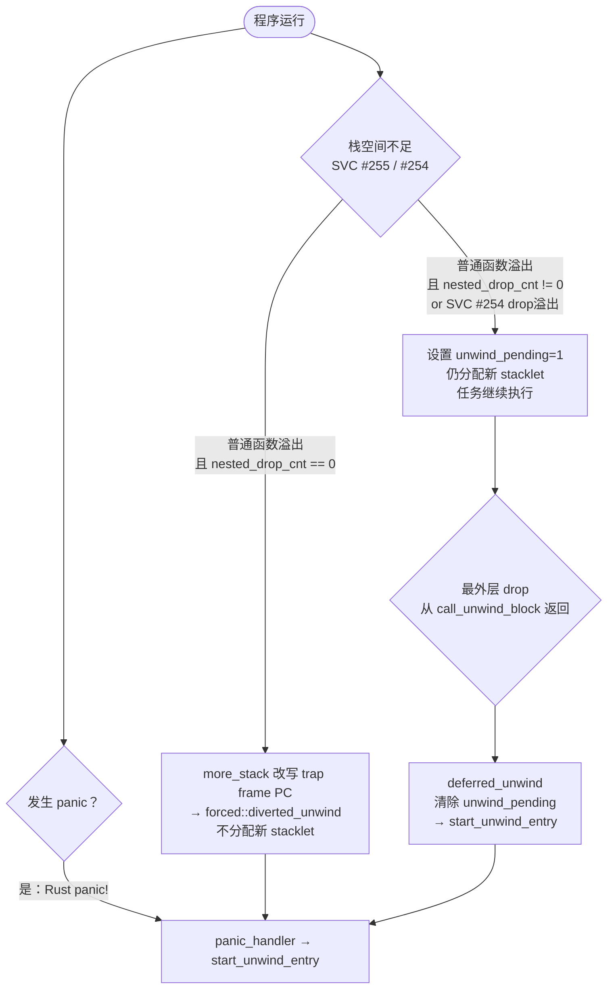
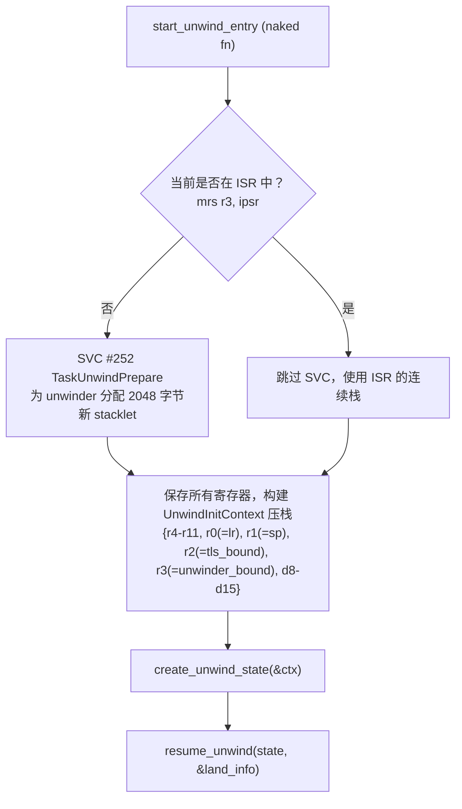
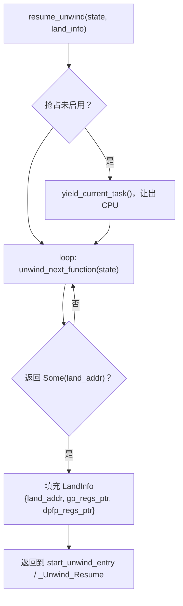
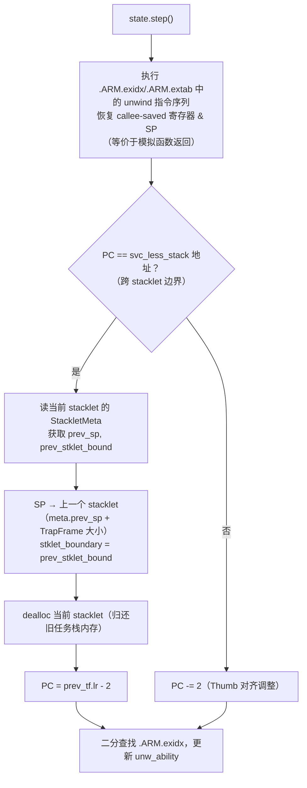
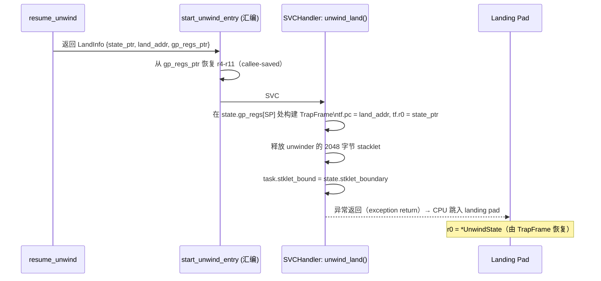
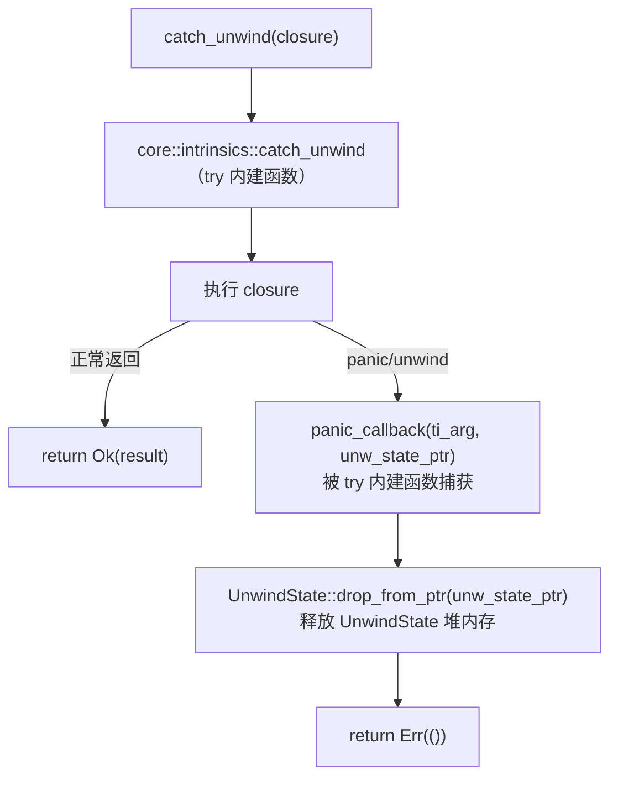
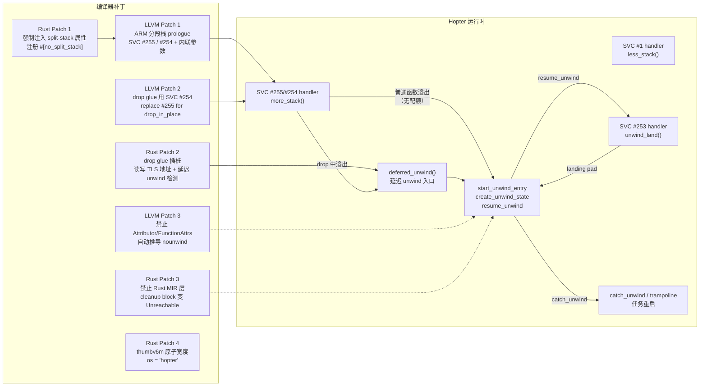

# Hopter 实现分析：分段栈、Panic Unwind 与编译器工具链

> 目标板：Cortex-M（ARMv6-M / ARMv7E-M），RTOS：Hopter。
> 本文档整合了分段栈机制、panic unwind 处理以及过程宏尝试三个方面的实现分析。

---

## 目录

1. [内存布局与核心约定](#1-内存布局与核心约定)
2. [分段栈：工具链改动](#2-分段栈工具链改动)
3. [分段栈：Hopter 运行时实现](#3-分段栈hopter-运行时实现)
4. [分段栈：反汇编实例分析](#4-分段栈反汇编实例分析)
5. [Panic Unwind：心智模型与总体设计](#5-panic-unwind心智模型与总体设计)
6. [Panic Unwind：工具链配合改动](#6-panic-unwind工具链配合改动)
7. [Panic Unwind：三条触发路径](#7-panic-unwind三条触发路径)
8. [Panic Unwind：执行过程详解](#8-panic-unwind执行过程详解)
9. [任务重启机制](#9-任务重启机制)
10. [过程宏尝试及其根本局限](#10-过程宏尝试及其根本局限)
11. [编译器各 Patch 协作关系总览](#11-编译器各-patch-协作关系总览)

---

## 1. 内存布局与核心约定

### 1.1 TLS 区域（固定地址 `0x2000_0000`）

Hopter 将 STM32 Cortex-M4 的片内 SRAM 起始地址作为内核与任务之间的通信区。所有字段均为 `repr(C)` 的 `TaskLocalStorage` 结构的前几个成员，与固定地址一一对应：

```
0x2000_0000  stklet_bound       (u32) ── 当前 stacklet 的底部边界地址
0x2000_0004  nested_drop_cnt    (u32) ── 当前调用栈上活跃的 drop handler 嵌套计数
0x2000_0008  unwind_pending     (u32) ── 延迟 unwind 标志（1 = 需要触发）
0x2000_000c  deferred_unwind_fn (fn()) ─ 指向 deferred_unwind() 的函数指针（启动时写入）
```

编译器生成的 prologue 和 drop glue 插桩直接通过这三个固定地址与内核交换信息，无需通过寄存器传参。

### 1.2 SVC 调用约定

| SVC 号 | 名称 | 触发时机 |
|--------|------|----------|
| `#255` | `TaskMoreStack` | 普通函数入口，栈不足 |
| `#254` | `TaskMoreStackFromDrop` | drop handler 入口，栈不足 |
| `#252` | `TaskUnwindPrepare` | unwind 开始或 `_Unwind_Resume` 时，为 unwinder 分配栈 |
| `#253` | `TaskUnwindLand` | 即将跳入 landing pad，需切换回 task 栈 |
| `#1`   | `TaskLessStack`  | 函数正常返回，释放当前 stacklet |
| `#0`   | `TaskDestroy`    | trampoline 函数返回时预设的伪调用，触发任务销毁 |

### 1.3 关键数据结构

**`StackletMeta`**（每个 stacklet 头部，紧跟在 stacklet 首地址处）：

```rust
pub struct StackletMeta {
    pub prev_stklet_bound: u32,  // 上一个 stacklet 的边界（0 = 初始 stacklet）
    pub prev_sp: u32,            // 切换到本 stacklet 前的 SP（上一个 stacklet 顶部的 TrapFrame 位置）
    pub extend_cnt: u32,         // 在本 stacklet 上发生的扩展次数（用于热分裂检测）
    pub count_size: u32,         // 本 stacklet 的统计大小
}
```

**`UnwindState`**（堆分配，unwind 过程的导航游标）：

```rust
pub struct UnwindState<'a> {
    pub gp_regs: [u32; 12],       // R0, R4-R11, SP, LR, PC（当前帧的寄存器快照）
    pub dpfp_regs: [u64; 8],      // D8-D15（仅 armv7em）
    pub unw_ability: UnwindAbility<'a>, // 当前帧的解帧信息（来自 .ARM.exidx/.ARM.extab）
    pub stklet_boundary: u32,     // 正在解帧的 stacklet 的边界
    pub is_initial: bool,         // 是否是首轮迭代
}
```

`gp_regs` 的索引映射（`ARMGPReg` enum）：

| 索引 | 0 | 1–8 | 9 | 10 | 11 |
|------|---|-----|---|----|----|
| 寄存器 | R0 | R4–R11 | SP | LR | PC |

---

## 2. 分段栈：工具链改动

Hopter 定制了 LLVM 和 rustc，通过 5 个独立补丁实现 ARM Cortex-M 的分段栈支持。

### 2.1 LLVM Patch 1：为 ARMv6-M / ARMv7-M 实现分段栈 prologue

（文件：`hopter-compiler-toolchain/llvm/llvm-1-implement-segmented-stack-for-ARMv6m-ARMv7m.patch`）

**核心改动**：重写 `llvm/lib/Target/ARM/ARMFrameLowering.cpp` 中的分段栈 prologue 生成逻辑。

**第一步：移除平台限制**

标准 LLVM 只允许 Android/Linux 使用分段栈。Hopter 是裸机 RTOS，补丁注释掉了这个限制：

```cpp
// 改前：裸机目标直接 fatal error
if (!ST->isTargetAndroid() && !ST->isTargetLinux())
    report_fatal_error("Segmented stacks not supported on this platform.");

// 改后：注释掉，裸机目标也可用
```

**第二步：调整 prologue 生成判断**

```cpp
// 改前：用 needsSplitStackProlog() 启发式判断（可能跳过非叶子函数）
if (!MFI.needsSplitStackProlog()) return;

// 改后：只要函数实际分配了栈帧（StackSize > 0）就生成检查
if (MFI.getStackSize() == 0) return;
```

**第三步：Thumb-2（ARMv7E-M）prologue 生成**

从固定 TLS 地址读取 `stklet_bound`，计算剩余空间并与帧大小比较：

```asm
; 等效生成汇编（帧大小 N 字节）
mov.w   r12, #0x20000000   ; TLS 首地址（stklet_bound 的地址）
ldr.w   r12, [r12]         ; r12 = *0x20000000 = 当前 stacklet 底部
subs.w  r12, sp, r12       ; r12 = SP - 底部 = 剩余空间
cmp.w   r12, #N            ; 与本函数所需字节数比较
bge     .ok                ; 空间足够 → 跳过 SVC
svc     #255               ; 空间不足 → 申请新 stacklet
.short  (N/4)              ; 内联参数：所需 word 数
.short  0                  ; 内联参数：栈传参 word 数
.ok:
  push {r4-r7, lr}
  sub  sp, #M
  ...
```

当 N 超过 `cmp.w` 的立即数编码范围（约 1023 字节），改用减法代替比较：

```asm
subs.w  r12, sp, r12       ; r12 = 剩余空间
subw    r12, r12, #N       ; r12 -= N（subw 支持 12-bit 零延伸立即数）
cmp.w   r12, #0            ; 等价于 剩余空间 >= N
```

三种情况对比：

| 帧大小范围 | 指令策略 | 说明 |
|------------|----------|------|
| < 1024 B | `cmp r12, #N` | 直接编码 |
| 1024–4095 B | `subw r12, r12, #N` + `cmp r12, #0` | Thumb2 12-bit 立即数 |
| 4096–65535 B | 两步减法 | 超出 12-bit 范围，拆分操作 |
| ≥ 65536 B | `report_fatal_error` | 不支持 |

若 `r12` 是当前函数的 live-in 寄存器，补丁会在检查前 `str r12, [sp, #-4]!` 保存，检查后 `ldr r12, [sp], #4` 恢复。

**第四步：Thumb-1（ARMv6-M）prologue 生成**

ARMv6-M 无法直接使用 `r12`，改用 `r0`/`r1` 并用 `push`/`pop` 保护：

```asm
push    {r0, r1}               ; 保存
movs    r0, #1
lsls    r0, r0, #29            ; r0 = 0x20000000
ldr     r0, [r0]               ; r0 = stklet_bound
mov     r1, sp
subs    r1, r1, r0             ; r1 = 剩余空间
movs    r0, #N                 ; r0 = 所需大小
cmp     r1, r0
pop     {r0, r1}               ; 恢复寄存器（pop 不影响 flags）
bge     .ok
svc     #255
.short  (N/4)
.short  0
.ok:
```

由于 Thumb1 立即数只有 8 位，加载较大的帧大小需要移位拼接：

| 大小范围 | 加载策略 |
|----------|----------|
| < 256 B | `movs r0, #N` |
| 256–1023 B | `movs r0, #(N/4)` + `lsls r0, #2` |
| 1024–65535 B | `movs r0, #(N/256)` + `lsls r0, #8` + `adds r0, #(N%256)` |

**SVC 后的内联参数机制**：SVC handler 从调用者的**返回地址处**（即 SVC 指令之后、两个 `.short` 处）直接读取参数，不占用寄存器。内核执行完后将返回地址跳过这 4 字节，避免 CPU 把数据当指令执行。

**链接器 stub**（`lld/ELF/Arch/ARM.cpp`）：Hopter 强制所有函数使用分段栈，不存在跨非分段栈调用，所以 `adjustPrologueForCrossSplitStack` 直接返回 `true`：

```cpp
bool ARM::adjustPrologueForCrossSplitStack(uint8_t *loc, uint8_t *end,
                                           uint8_t stOther) const {
  return true;
}
```

---

### 2.2 LLVM Patch 2：区分 drop handler 的 SVC 号

（文件：`hopter-compiler-toolchain/llvm/llvm-2-distinguish-drop-handlers.patch`）

对于函数名前缀为 `_ZN4core3ptr` 的 drop glue 函数（`core::ptr::drop_in_place` 系列），LLVM 改用 **SVC #254**（`TaskMoreStackFromDrop`）代替 #255，让内核能区分"普通函数栈溢出"和"drop handler 栈溢出"。

两者的 more_stack 处理逻辑不同：
- SVC #255（普通函数）：可以直接强制 unwind（改写 PC）
- SVC #254（drop handler）：不能立即 unwind——必须走延迟路径（设置 `unwind_pending=1`，先让 drop 完成）

---

### 2.3 LLVM Patch 3 + Rust Patch 3：禁止 nounwind 自动推导

（文件：`llvm-3-prevent-automatic-nounwind-deduction-for-functions.patch`，`rust-3-prevent-nounwind-optimization.patch`）

**为什么必须禁止 `nounwind`**：

LLVM 的 `nounwind` 属性表示"该函数保证不 unwind"。一旦函数被标记为 `nounwind`，编译器会：
- 删除该函数的 `.ARM.exidx` / `.eh_frame` unwind 表
- 将所有调用该函数的 `invoke` 降级为 `call`（省略 landing pad）

但 Hopter 的分段栈 prologue 会在任意函数入口触发强制 unwind（通过 `diverted_unwind`）。如果调用路径上有函数缺少 unwind 表，栈展开器就无法穿越它，导致强制 unwind 失败、资源泄漏。

**两条独立推导路径都必须禁用**：

| 路径 | 所在 Pass | 算法 | 禁用方式 |
|------|-----------|------|----------|
| **Attributor** | `Attributor.cpp` + `AttributorAttributes.cpp` | 迭代定点：推断函数是否 nounwind | 注释掉 `AANoUnwind` 类定义、实现、注册和查询 |
| **FunctionAttrs** | `FunctionAttrs.cpp` | SCC 遍历：SCC 内无 throw → 打 `nounwind` | 注释掉 `registerAttrInference` 调用 |

Rust 侧（rust-3）同样注释掉三处：
1. `abi.rs apply_attrs_llfn`：不再给函数定义加 `nounwind` LLVM 属性
2. `abi.rs apply_attrs_callsite`：不再给调用点加 `nounwind`
3. `instsimplify.rs simplify_nounwind_call`：MIR pass 变为 no-op，不删除 cleanup block

两者缺一不可：即使 rustc 不标记 `nounwind`，LLVM 优化器仍然会通过分析重新推导出来。

---

### 2.4 Rust Patch 1：强制开启分段栈

（文件：`rust-1-force-using-segmented-stacks.patch`）

**两件事**：① 注册 `#[no_split_stack]` 属性；② 对 ARM 裸机目标的所有函数强制注入 LLVM `"split-stack"` 字符串属性。

注册 `#[no_split_stack]` 需要打通 Rust 的 attribute pipeline（4 个文件）：

```
rustc_span/src/symbol.rs         ← 注册符号名 "no_split_stack"
rustc_feature/src/builtin_attrs.rs ← 声明为内置属性（无需 feature flag）
rustc_middle/...codegen_fn_attrs.rs ← 新增 bit flag NO_SPLIT_STACK = 1 << 20
rustc_codegen_ssa/...codegen_attrs.rs ← 解析阶段映射属性名到 flag
```

强制注入 `"split-stack"` 属性（在 `rustc_codegen_llvm/src/attributes.rs`）：

```rust
if cx.sess().target.llvm_target.contains("thumbv7em-none-eabi")
  || cx.sess().target.llvm_target.contains("armv7em-none-eabi")
  || cx.sess().target.llvm_target.contains("thumbv6m-none-eabi")
  || cx.sess().target.llvm_target.contains("armv6m-none-eabi") {
    if !codegen_fn_attrs.flags.contains(CodegenFnAttrFlags::NO_SPLIT_STACK) {
        to_add.push(llvm::CreateAttrString(cx.llcx, "split-stack"));
    }
}
```

`"split-stack"` 是 LLVM 字符串型属性（不是枚举型），LLVM ARM 后端（patch 1 改动的文件）检测到它后才触发 prologue 生成。两侧改动完全解耦。

---

### 2.5 Rust Patch 2：插桩 drop handler

（文件：`rust-2-instrument-drop-handlers.patch`，改动 `compiler/rustc_mir_transform/src/shim.rs`）

这是四个补丁里最复杂的，在 MIR 层修改 drop glue（析构函数包装器）的生成逻辑。

**原始 drop shim**：

```
block 0 (START_BLOCK):  drop(value)  →  block 1
block 1:                return
```

**改造后的 drop shim（8 个基本块）**：

```
set_drop_block (0):
    old_val = *(0x2000_0004)       ; 读旧 nested_drop_cnt
    *(0x2000_0004) = 1             ; 置为"进入 drop 中"
    → drop_start_block

drop_start_block (1) → drop_end_block (2):
    （实际的析构逻辑，原来的 drop shim 内容）

drop_end_block → check_drop_block (3)

check_drop_block:
    switchInt(old_val):
        0 → check_unwind_block     ; 最外层 drop（old_val 在 drop 中被内核清零）
        _ → return_block           ; 还在内嵌 drop，直接返回

check_unwind_block (4):
    flag = *(0x2000_0008)          ; 读 unwind_pending
    switchInt(flag):
        0 → reset_drop_block       ; 不在 unwind，普通 drop
        _ → call_unwind_block      ; 正在强制展开

call_unwind_block (5):
    fn_ptr = *(0x2000_000c)        ; 读 deferred_unwind 函数指针
    (*fn_ptr)()                    ; 调用，触发 unwind

reset_drop_block (6):
    *(0x2000_0004) = 0             ; 恢复 nested_drop_cnt = 0
    → return_block

return_block (7):
    return
```

三个通信地址的语义：

| 地址 | 字段 | 语义 |
|------|------|------|
| `0x2000_0004` | `nested_drop_cnt` / `in_drop_flag` | 标记是否在 drop handler 中，防止运行中再次 unwind |
| `0x2000_0008` | `unwind_pending` / `is_unwinding` | 内核设置：当前任务是否正在被强制展开 |
| `0x2000_000c` | `deferred_unwind_fn` | 内核填入的展开推进函数地址 |

---

### 2.6 Rust Patch 4：thumbv6m 目标原子支持

（文件：`rust-4-enable-atomic-instr-for-thumbv6m.patch`）

改动 `thumbv6m-none-eabi` 目标规格：

```rust
// 改前
features: "+strict-align,+atomics-32".into(),
atomic_cas: false,

// 改后
os: "hopter".into(),             // 声明 OS 为 "hopter"，用于平台识别
features: "+strict-align,+atomics-32".into(),
max_atomic_width: Some(32),      // 允许 32-bit 原子 load/store（ldrex/strex）
```

`os: "hopter"` 让 LLVM 后端和 Rust 侧都能用 `target.os == "hopter"` 识别平台，避免蹭 Android/Linux 路径。`max_atomic_width: Some(32)` 比原来的 `atomic_cas: false` 粒度更细——ARMv6-M 支持 `ldrex`/`strex` 32-bit 原子，但没有 CAS 指令。

---

## 3. 分段栈：Hopter 运行时实现

### 3.1 `more_stack()`：SVC #255 / #254 handler

当分段栈 prologue 触发 SVC #255 或 #254 时，内核的 `more_stack()` 负责处理：

```
SVC #255 触发（普通函数栈溢出）
  ├─ 读取 trap frame 中 saved PC 后的两个 .short（帧大小、传参大小）
  ├─ 检查任务是否有动态栈配额（is_dynamic_ext_allowed）
  │   ├─ 允许扩栈
  │   │   ├─ 分配新 stacklet（大小 = max(请求大小 + meta头, 最小阈值)）
  │   │   ├─ 将新 stacklet 的 StackletMeta 初始化（prev_stklet_bound, prev_sp）
  │   │   ├─ 更新 task TLS: stklet_bound = 新 stacklet 底部
  │   │   ├─ 调整 saved SP 指向新 stacklet 顶部
  │   │   └─ 修改 saved PC 跳过两个 .short（指向 .ok 标签）
  │   └─ 不允许扩栈（强制 unwind）
  │       ├─ 若当前不在 drop handler（nested_drop_cnt == 0）
  │       │   └─ 改写 saved PC 为 diverted_unwind 地址 → 触发强制 unwind
  │       └─ 若当前在 drop handler（nested_drop_cnt != 0）→ 延迟路径（见下）

SVC #254 触发（drop handler 栈溢出）
  └─ 设置 unwind_pending = 1
     仍分配新 stacklet（让 drop 能继续执行完毕）
     → drop 返回时编译器插入的 epilogue 检测到 unwind_pending，触发延迟 unwind
```

**为什么 drop handler 栈溢出必须走延迟路径**：若在 drop handler 中途立即触发 unwind，会导致同一对象析构两次（原来的 drop 执行到一半，unwind 又调用一次 drop）——这是内存安全问题。必须等 drop 走完再启动 unwind。

### 3.2 `less_stack()`：SVC #1 handler

函数正常返回时，CPU 执行的返回地址被设置为 `svc_less_stack`，触发 SVC #1：

```
SVC #1 触发（函数正常返回）
  ├─ 从当前 stacklet 的 StackletMeta 读取 prev_stklet_bound、prev_sp
  ├─ 恢复 SP → 上一个 stacklet（meta.prev_sp 处的 TrapFrame 位置）
  ├─ 恢复 task TLS: stklet_bound = prev_stklet_bound
  └─ 释放当前 stacklet 的内存
```

### 3.3 stacklet 链表结构

```
初始 stacklet（任务创建时分配）：
+------------------+
| StackletMeta     |  prev_stklet_bound = 0（无前驱）
| {prev=0, sp=0}   |  prev_sp = 0
+------------------+
| 函数帧...        |
+------------------+  ← stklet_bound（当前边界）

   ↓ 若空间不足，分配新 stacklet，StackletMeta 链上去

新 stacklet（动态分配）：
+------------------+
| StackletMeta     |  prev_stklet_bound = 上一个 stacklet 的 bound
| {prev=..., sp=.} |  prev_sp = 切换前的 SP（即上一个 stacklet 内的 TrapFrame 地址）
+------------------+
| 函数帧...        |
+------------------+  ← stklet_bound 更新为此处
```

正常返回时 SVC #1 弹出最顶层 stacklet；unwind 时 `state.step()` 在检测到 `svc_less_stack` 地址时弹出并 `dealloc`。

---

## 4. 分段栈：反汇编实例分析

`segstk-demo/` 项目编译后的完整 prologue 实例：

### 4.1 小帧函数（`small_fn`，帧 40 B）

```asm
8000064:  mov.w   r12, #536870912    ; r12 = 0x20000000
8000068:  ldr.w   r12, [r12]        ; r12 = *0x20000000（stacklet 底部）
800006c:  subs.w  r12, sp, r12      ; r12 = 剩余空间
8000070:  cmp.w   r12, #40          ; 直接比较 40 字节
8000074:  bge     0x800007c
8000076:  svc     #255
8000078:  .short  0x000a            ; 10 words = 40 字节
800007a:  .short  0x0000
800007c:  push    {r7, lr}          ; 正常 prologue（8 B）
800007e:  mov     r7, sp
8000080:  sub     sp, #32           ; 局部变量区（32 B）
          ...
80000ac:  pop     {r7, pc}
```

帧大小：8 + 32 = **40 B**，与 `cmp #40` 精确吻合。

### 4.2 大帧函数（`large_fn`，帧 1056 B）

```asm
8000124:  mov.w   r12, #536870912
8000128:  ldr.w   r12, [r12]
800012c:  subs.w  r12, sp, r12
8000130:  subw    r12, r12, #1056   ; 改用减法（1056 超出 cmp 立即数范围）
8000134:  cmp.w   r12, #0
8000138:  bge     0x8000140
800013a:  svc     #255
800013c:  .short  0x0108            ; 264 words = 1056 字节
800013e:  .short  0x0000
8000140:  push    {r4-r7, lr}       ; 20 B
8000142:  ...
8000148:  sub.w   sp, sp, #1024     ; 1024 B
```

1056 = `0x420`，Thumb2 `cmp.w` 的 12-bit 旋转编码无法表示，改用 `subw + cmp #0`。

### 4.3 `#[no_split_stack]` 函数（无 prologue）

```asm
8000182:  push    {r4, r5, r6, r7, lr}  ; 直接进入函数体，无任何检查
          ...
```

没有 `mov.w / ldr.w / subs.w / cmp.w / bge / svc` 指令。`#[no_split_stack]` 属性由 rust patch 1 引入，适用于：`#[no_split_stack]` 内核中分配 stacklet 的代码（防止无限递归）、中断处理函数等对延迟极敏感的场景。

---

## 5. Panic Unwind：心智模型与总体设计

### 5.1 Unwind 的真实目的

Unwind 不是"采集栈信息，然后重启任务"。它做的是：

> **沿调用栈反向逐帧走一遍，在每一帧里执行编译器为那帧的局部变量生成的析构代码（drop handler），从而把该帧占有的所有资源（堆内存、锁、信号量……）全部归还系统，最终让系统处于干净状态。**

**如果不做 unwind，直接 kill 任务**：
- `Box<T>` / `Arc<T>` 不 drop → 堆内存永远泄漏
- `MutexGuard` 不 drop → 锁永远不释放 → 其他任务死锁
- 外设寄存器不归还 → 系统状态不可预知

任务重启是**副产品**，且发生时机比预想的早——在 unwind 初始化阶段（`create_unwind_state`）就已经并发启动了新的任务实例。

### 5.2 阶段与意义对照

| 阶段 | 核心动作 | 对任务生命周期的意义 |
|------|----------|---------------------|
| **触发（panic / 栈溢出）** | 选择 unwind 入口 | 检测到任务不可恢复 |
| **`create_unwind_state`** | 降低旧任务优先级；若可重启则立即并发启动新实例 | 新任务已在运行；旧任务进入低优先级清理模式 |
| **`resume_unwind` + `state.step()`** | 反向读取 `.ARM.exidx/.ARM.extab`，模拟"函数返回"；跨 stacklet 时释放 stacklet 内存 | **归还旧任务占用的栈内存**（stacklet 逐个 free 回堆）；寄存器/SP 模拟只是导航手段 |
| **跳入 Landing Pad** | 执行编译器生成的 drop 代码 | **归还该帧占有的堆对象、锁、信号量等资源** |
| **`_Unwind_Resume`** | cleanup 执行完后继续向上走下一帧 | 驱动清理流程前进 |
| **`catch_unwind` 边界** | 拦截 unwind，释放 `UnwindState` | 标志旧任务的清理彻底完成 |
| **`restartable_task_entry` loop** | 检测 `catch_unwind` 返回 `Err(())`，重新执行 closure | 若未并发重启，在此顺序重启 |

> **`UnwindState.gp_regs` 的用途**：不是"记录崩溃现场"，而是用来模拟函数返回、定位每一帧 landing pad 在内存中的位置。走完一帧，游标里的 SP/PC 就更新为上一帧的状态，就像迭代游标一样。

---

## 6. Panic Unwind：工具链配合改动

Unwind 能工作依赖 patch 2、3 的配合（patch 1 和 4 见分段栈章节）：

**Rust Patch 2 的 drop glue 插桩**（见 2.5 节）使得每个带析构器的对象在 drop 结束时都会检测 `unwind_pending`，如果发现需要继续展开，就调用存储在 `0x2000_000c` 的内核函数推进 unwind。这是延迟 unwind 路径的关键驱动器。

**LLVM Patch 3 + Rust Patch 3 的 nounwind 禁用**（见 2.3 节）保证了 unwind 能穿越调用栈上**所有函数**—— `.ARM.exidx` 表不缺失，`invoke` 的 landing pad 不被优化掉。

---

## 7. Panic Unwind：三条触发路径



### 路径一：Rust panic（主动 unwind）

`panic!()` → panic handler → `start_unwind_entry()`

任务主动检测到不可恢复错误。unwind 把这次调用链上持有的所有资源清理干净后重启。

### 路径二：强制 unwind（栈溢出，普通函数）

1. 分段栈 prologue → SVC #255 → 内核 `more_stack()`
2. 检查：无动态栈配额 + 当前不在 drop handler 中
3. 改写 trap frame 的 `PC` 为 `diverted_unwind` 地址（不分配 stacklet）
4. SVC 异常返回 → CPU 跳入 `diverted_unwind` → 跳至 `start_unwind_entry()`

任务分配的栈空间超出配置上限。内核强行劫持执行流到 unwind 入口，从头清理后重启。

### 路径三：延迟强制 unwind（在 drop handler 中栈溢出）

1. drop handler 内触发 SVC #254 → `more_stack()` 设置 `unwind_pending = 1`，仍分配 stacklet
2. drop 继续执行完毕
3. 编译器插入的 epilogue（check_drop_block → check_unwind_block → call_unwind_block）检测到 `unwind_pending = 1`
4. 调用 `*0x2000_000c`（`deferred_unwind()`）：清除 `unwind_pending` 和 `nested_drop_cnt` → 跳至 `start_unwind_entry()`

不能在 drop 中途触发 unwind（双重析构），必须等 drop 走完。

---

## 8. Panic Unwind：执行过程详解

### 8.1 `start_unwind_entry`：unwind 的初始化

这是一个 naked 函数，作为进入 unwind 引擎的汇编入口：



**`create_unwind_state()` 的步骤**：

1. 若 `IS_UNWINDING` 已设置（二次 panic） → 调用 `die()` halt，防止无限递归
2. 设置 `IS_UNWINDING` 标志
3. **若任务可重启：`try_spawn_restarted()` 创建新任务实例并入就绪队列；旧任务优先级降至 `UNWIND_PRIORITY`（最低）**
4. 分配 `UnwindState`（任务中在堆分配；ISR 中使用全局 `STATIC_UNWIND_STATE`）
5. 从 `UnwindInitContext` 填充 `gp_regs`，`PC = LR - 2`（指向触发 unwind 的调用指令）
6. 二分查找 `.ARM.exidx` 获取首帧的 `UnwindAbility`
7. `stklet_boundary = before_unwind_stklet_bound`

> **步骤 3 就是并发重启的发生点**：`try_spawn_restarted()` 通过 `Arc::clone` 共享原始任务的 entry closure（只增引用计数，不复制闭包体），创建新任务实例并立即加入调度器就绪队列。旧任务降至最低优先级让出 CPU，新任务几乎在 panic 同一时刻就能开始运行。

### 8.2 `resume_unwind`：主循环



**`unwind_next_function()` 的逻辑**：

```
is_initial = true 时：
    清除 is_initial，保持当前帧（首帧不执行 step()）

is_initial = false 时：
    调用 state.step()，退出当前帧，进入调用者帧

→ 检查当前帧是否有 LSDA（.ARM.extab 扩展表）
→ 若有，查找 LSDA call site table，寻找当前 PC 所在的 call site
→ 若 call site 有 landing pad 地址 → return Some(land_addr | 1)（Thumb 模式位）
→ 否则 → return None，继续下一帧
```

**`state.step()` 的帧间迁移**：



`.ARM.exidx` 里存储的是"如何撤销该函数的 prologue"——弹哪些寄存器、SP 加多少。这是导航上一帧的机制，不是崩溃记录。**每次跨 stacklet 时 dealloc 旧 stacklet，就是旧任务栈内存被逐步归还堆的过程**。

### 8.3 进入 Landing Pad（SVC #253）



**为什么必须通过 SVC #253 切换**：`resume_unwind()` 运行在 unwinder stacklet 上（SVC #252 分配的），而 landing pad 需要运行在**原始任务栈**的上下文里（否则局部变量的地址不对，drop 运算结果不正确）。SVC #253 负责：释放 unwinder 栈、在任务栈正确位置构建 TrapFrame、异常返回跳入正确位置。

**ISR 情况**：若 `ipsr != 0` 则跳过 SVC #253，直接 `ldr sp, [r2, #32]` 恢复 SP 后 `bx r1`。

### 8.4 Cleanup Landing Pad 执行

Landing pad 是编译器为含 `Drop` impl 的函数帧生成的 cleanup 代码。执行顺序：

```
进入 landing pad（r0 = UnwindState*）
  → 执行各局部变量的 drop（drop glue 被 rust-2 patch 插桩）
  → 编译器自动生成 bl _Unwind_Resume(r0)
```

`_Unwind_Resume` 的逻辑与 `start_unwind_entry` 类似：申请新 unwinder stacklet（SVC #252）→ 调用 `resume_unwind()` → 恢复寄存器 → SVC #253 跳入下一 landing pad。

### 8.5 catch_unwind 边界

每个任务的入口 closure 都被包在 `catch_unwind` 里（`task::trampoline`）。当 unwind 一路传播到此时，说明**调用链上所有帧的 drop 都已执行完毕**，所有资源已归还。



---

## 9. 任务重启机制

### 9.1 任务生命线全图

```
panic / 栈溢出
  ↓
start_unwind_entry → create_unwind_state
  ① IS_UNWINDING 设置
  ② try_spawn_restarted() → 新任务实例入就绪队列（Arc::clone entry_closure）
  ③ 旧任务优先级降至 UNWIND_PRIORITY（最低）
  ④ yield_current_task() → 新任务立即运行

旧任务（低优先级，后台）：
  resume_unwind loop → state.step()（stacklet 逐步释放）→ landing pad（drop 执行）
  → catch_unwind 返回 Err(())

restartable_task_entry:
  if has_restarted() == true → break → 旧任务 trampoline return（并发重启路径）
  if has_restarted() == false → clear unwind_flag → loop（顺序重启路径）

trampoline return
  → CPU 执行 lr 里预设的 svc_destroy_current_task 地址
  → SVC #0 TaskDestroy
  → drop_current_task_from_svc()：TaskState = Destructing，触发 PendSV
  → pick_next 发现 Destructing → Arc 不放回就绪队列 → 引用计数归零 → Task 释放
```

### 9.2 并发重启

```
并发重启条件（try_concurrent_restart 检查）：
1. 任务在创建时设置了 allow_concurrent_restart（用户显式配置）
2. 当前任务若是重启实例，其"原始实例"的 Arc strong_count == 0（防止重启链叠加）
```

新任务用相同的 `Arc<entry_closure>`（引用计数 +1）创建，几乎在 panic 同时就入就绪队列运行。旧任务退至最低优先级，unwind 清理在后台零碎执行，完全不阻塞新任务。

**关键函数**（`task_struct.rs Task::restart_from`）：

```rust
// restart_from() 核心:
// Arc::clone entry_closure（只增引用计数，不复制闭包体）
// 设置 prev_task.has_restarted = true
// initialize_common() 以相同优先级初始化新任务
// tf.gp_regs.lr = svc::svc_destroy_current_task as u32 | 1  （任务销毁预设返回地址）
```

### 9.3 顺序重启

当 `try_spawn_restarted()` 失败（如任务数量达上限），旧任务不降低优先级，继续以原优先级执行 unwind 清理。`catch_unwind` 返回 `Err(())` 后：

```rust
// restartable_task_entry（task/trampoline.rs）
loop {
    match catch_unwind(|| entry_closure()) {
        Ok(()) => break,
        Err(()) => {
            if has_restarted() { break; }   // 并发重启已完成
            // 顺序重启：清除 unwind flag，重新执行
            clear_unwind_flag_with_catch_unwind();
            // 若连清除 flag 的 catch_unwind 都再次失败 → 放弃重启
            if /* 再次失败 */ { break; }
        }
    }
}
```

### 9.4 任务销毁（SVC #0）

旧任务的 trampoline 函数返回时，会执行 `lr` 寄存器里预设的 `svc_destroy_current_task` 地址（在初始化时伪造）：

```rust
// 初始化时（task_struct.rs initialize_common）:
tf.gp_regs.lr = svc::svc_destroy_current_task as u32 | 1;
// 任务"调用者"被伪造为 svc_destroy_current_task，
// trampoline return 时 CPU 自动跳此地址并执行 SVC #0
```

```
SVC #0 handler（drop_current_task_from_svc）：
  cur_task.set_state(TaskState::Destructing)
  SCB::set_pendsv()
  ↓
pick_next（PendSV handler）：
  发现 Destructing 状态 → 不放回就绪队列 → Arc 引用计数归零 → Task 自动 Drop
```

---

## 10. 过程宏尝试及其根本局限

### 10.1 尝试的出发点

目标：在**不修改编译器工具链**的情况下，通过 Rust 过程宏（proc macro）为函数插入分段栈检查逻辑。

`segstk-proc-macro-exp/` 中的尝试思路：过程宏 `#[fake_split_stack(N)]` 把函数改写，在函数体最开头插入对 `fake_split_stack_entry(N)` 的调用；`fake_split_stack_entry` 用内联汇编做栈剩余空间检查。

**过程宏实现（`segstk-attr/src/lib.rs`）**：

```rust
#[proc_macro_attribute]
pub fn fake_split_stack(attr: TokenStream, item: TokenStream) -> TokenStream {
    let frame = attr.to_string().trim().to_string();  // 帧大小（需手工传入）
    let item_src = item.to_string();
    let brace_pos = item_src.find('{').unwrap();
    let (head, tail) = item_src.split_at(brace_pos + 1);
    // 在函数体 "{" 之后插入调用
    format!("{head} crate::fake_split_stack_entry({frame}usize); {tail}")
        .parse().unwrap()
}
```

**运行时检查（`demo/src/main.rs`）**：

```rust
#[no_mangle]
#[inline(never)]
pub extern "C" fn fake_split_stack_entry(frame: usize) {
    unsafe {
        let need_morestack: u8;
        core::arch::asm!(
            "mov r11, rsp",
            "sub r11, {frame}",
            "cmp r11, qword ptr fs:[0x70]",
            "setbe {need_morestack}",
            // ...
        );
        if need_morestack != 0 { fake_morestack(frame); }
    }
}

#[fake_split_stack(376)]  // 帧大小需手工估算！
#[inline(never)]
pub extern "C" fn macro_large_fn(seed: i32) -> i32 {
    let mut buf = [0i32; 64];
    // ...
}
```

### 10.2 核心问题一：prologue 的先后顺序

这是**最根本的失败原因**，用户笔记中也有直接验证：

当宏把 `fake_split_stack_entry(N)` 插入函数体后，**编译器的 prologue（push 寄存器、sub sp）已经先于这个插入点执行了**。

反汇编（x86_64 上的直接观察）：

```asm
segstk_demo::foo:
  cmp     rsp, qword ptr fs:[112]   ← 这是 toolchain 插的检查（在 prologue 之前）
  jbe     .LBB10_1
.LBB10_2:
  push    rax                       ← 这是编译器 prologue（已分配栈帧）
  #APP
  nop                               ← 这里才是过程宏插的 inline asm（栈帧已分配完毕！）
  nop
  #NO_APP
  call    segstk_demo::bar
  ...
.LBB10_1:                           ← 只有 toolchain 路径才能在帧分配前检查
  mov     r10d, 8
  call    __morestack
  ret
  jmp     .LBB10_2
```

LLVM 生成 prologue 的顺序是在**机器码生成阶段**（`FrameLowering::emitPrologue`）确定的，它总是在函数入口**最先执行**。过程宏只能在源码展开阶段改写 Rust 语法树，展开后生成的代码会被编译器进一步处理，prologue 照样在最前面。

**结果**：到达宏插入的检查代码时，SP 已经被调整过了——栈帧已经分配，即使这时检测到"空间不足"也太晚了，溢出已经发生。

### 10.3 核心问题二：frame size 不可知

编译器的最终帧大小由多个因素共同决定，过程宏完全无法获取：

| 影响因素 | 过程宏能看到？ |
|----------|----------------|
| 局部变量和大数组 | 部分（源码级） |
| 编译优化后的临时对象 | **否** |
| 寄存器 spill slot | **否** |
| callee-saved 寄存器保存区 | **否** |
| 调用其他函数的 ABI 需要 | **否** |
| 栈对齐 padding | **否** |
| unwind/drop/panic 附加开销 | **否** |

过程宏只能在**源码层面估算**帧大小（如手写 `376`），编译优化后真实帧大小可能更大，导致：
- 估小了 → 检查通过，但仍然溢出
- 估大了 → 频繁走 morestack 慢路径，性能变差

LLVM 的 `FrameLowering::PrologEpilogInserter` 在机器码生成阶段已经完成了寄存器分配、spill 插入、对象布局后，才能知道精确的帧大小。过程宏运行时这些信息根本不存在。

### 10.4 核心问题三：入口覆盖不完整

过程宏只能包住**显式标注的函数**。以下情况会绕过宏生成的包装层：
- 函数指针被赋值后从别处调用
- `extern "C"` 符号被汇编或 FFI 代码直接引用
- 链接/内联后产生的入口变体
- 编译器自动生成的函数（drop glue、closure 等）

编译器插 prologue 的方案：**只要进入这个函数，就一定先做 stack check**（prologue 在函数机器码入口的最开始）。

过程宏方案：**只有走了宏生成的 wrapper，才会做检查。** 任何绕过 wrapper 的路径都没有保护。

### 10.5 对比总结

| | 过程宏 / trampoline 方案 | 编译器（LLVM）插 prologue |
|---|---|---|
| **检查时机** | 函数体内（prologue 之后） | 函数入口（prologue 之前）|
| **frame size 来源** | 手工估算，可能不准 | 编译器精确计算（含所有 spill/对齐）|
| **覆盖范围** | 只有显式标注的函数 | 所有带栈帧的函数（含 drop glue）|
| **实现成本** | 不改编译器，实验快 | 需修改 LLVM + rustc |
| **是否可靠** | 不可靠（入口可被绕过，frame 可能估错）| 可靠（编译器保证证正确性）|

**结论**：过程宏可以作为原型验证工具（验证控制流结构是否正确），但在**正确性**上无法替代工具链改动。真正的分段栈需要在编译器最内层（机器码生成阶段、prologue 之前）插入检查，这只能通过修改 LLVM 实现。

### 10.6 进一步追问：能不能改 ELF 来代替改编译器？

既然过程宏改不了真正的 prologue，自然会想到**直接改最终产物**：在已经编译好的 ELF 里，找到每个函数符号入口，给它前面塞一段栈检查 prologue。

这种思路属于 **静态二进制重写（static binary rewriting）**，工业上有真实工具（Dyninst、E9Patch、Egalito、Retrowrite 等），所以**不是"完全做不到"**。但它**仍然不能替代修改编译器**，原因不是单一的"做不到"，而是几个层次叠加起来的硬约束。

#### 10.6.1 ELF 重写大致能做到的事

如果只是机械地"插指令"，ELF 层确实有抓手：

- `.symtab` / `.dynsym` 可以列出大部分函数符号入口；
- `.text` 里的机器码可以反汇编，识别出 `sub rsp, N` 这一类帧分配指令；
- `.eh_frame` / DWARF CFI 可以告诉你 callee-saved 寄存器、`CFA = rsp + N` 等部分 frame 信息；
- 可重定位文件（`.o`）允许新增 section、改重定位、插 trampoline。

也就是说，**"在每个函数入口前插一段 stub，跳过去做检查再跳回来"** 这件事，在 ELF 层是可以做的。

#### 10.6.2 但有几个根本性的难点和过程宏类似——只是"位置"不同

ELF 重写比过程宏强的地方在于：它至少能看到所有真实机器码符号、看到最终的 `sub rsp, N`。但它仍然有几个**与 LLVM 后端比起来无法弥补**的问题：

##### 问题 A：真实 frame size 在 ELF 层只能"近似"

LLVM 在 `FrameLowering::emitPrologue` 时知道：

- 局部变量、临时对象、spill slot
- callee-saved 保存区
- 出参传递区（outgoing args）
- ABI 对齐 padding
- alloca / VLA / red zone 等动态部分
- panic / unwind / drop glue 占用的影子空间

而 ELF 重写**只能事后看 `sub rsp, N`**，这只是其中"已经合并完成的最终值"，无法区分这些组成部分；动态部分（alloca、运行期对齐）更是完全不可见。换句话说：

> 编译器看到的是"为什么是 N"；ELF 重写看到的是"现在是 N"——后者足以做粗粒度检查，但做不到精确、可证明的 prologue。

##### 问题 B：你不能在原入口"原地"插指令

`.text` 是固定布局的字节流，在原入口前插指令意味着函数地址改变，而所有 `call foo`、函数指针、vtable、跳转表、`.eh_frame`/CFI、PLT/GOT 重定位 **都是按原地址索引的**。所以实际只能：

- **方案 A**：把入口前几条指令改成 `jmp stub`，stub 检查后跳回——但原指令长度可能不够装下一条 5 字节 jmp（x86_64），ARM 上还要考虑跳转范围、对齐和 IT block；
- **方案 B**：把整个函数搬到新 section，原地址放 trampoline，再修复所有 relocation 与 CFI——这就是 Dyninst / E9Patch 实际做的事，工程量极大。

##### 问题 C：异常处理 / unwind / debug 信息会被同步打乱

只要动了函数入口或中间位置，下面这些表必须跟着改：

- `.eh_frame_hdr` / `.eh_frame` 里的 FDE
- `.gcc_except_table`（landing pad、call site）
- `.debug_info` / `.debug_line`
- ARM 上的 `.ARM.exidx` / `.ARM.extab`

任何一项不同步，后果直接对应 Hopter 关心的核心机制：

- panic unwind 失败、析构函数被跳过；
- backtrace / gdb 看到错误的栈；
- 已经为分段栈调好的 unwinder 行为被破坏。

##### 问题 D："每个函数符号"这个集合本身就不完整

ELF 符号表里看到的函数 ≠ 真正会被执行的入口：

- 被 inline 掉的函数没有独立符号；
- LTO / ICF（identical code folding）会把多个函数合并成同一段代码；
- drop glue、closure、async 状态机生成的函数可能没有友好符号；
- thunk、PLT stub、outlined function 也是函数样的代码块，但容易被遗漏。

也就是说：**"给每个函数符号都加 prologue"——这个集合本身就漏。**

##### 问题 E：调用者并不一定走符号入口

下面这些路径在运行时是真的会进入函数体的：

- 函数指针、vtable
- `setjmp/longjmp`
- C++/Rust 异常 unwind 时的 landing pad
- inline asm 跳到内部 label
- tail call 直接跳到函数中部
- coroutine / `async` resume

ELF 符号入口看不到这些"逻辑入口"。只在符号入口加 prologue，**这些路径全部绕过了检查**——和过程宏的"入口覆盖不完整"问题是同一个，只是改在了产物层。

#### 10.6.3 三种方案的能力对比

| 能力 | 过程宏 | ELF 重写 | 改编译器 / LLVM |
|---|---|---|---|
| 知道真实 frame size | ❌ 仅源码级估算 | ⚠️ 仅能看 `sub rsp, N`，缺少组成 | ✅ 精确（spill/对齐/ABI 都知道） |
| 在每个真实入口插 prologue | ❌ 仅显式标注的函数 | ⚠️ 大部分函数符号 | ✅ 所有带栈帧的函数 |
| 处理 inline / LTO / ICF / outlined | ❌ | ❌（信息已丢失） | ✅ |
| 与 unwind / DWARF / 异常表一致 | 不涉及 | ⚠️ 必须自己同步重建 | ✅ 自动一致 |
| 处理 tail call / 函数中部入口 | ❌ | ❌ | ✅ |
| 工程难度 | 低 | **极高（接近一个完整 binary rewriter）** | 中等（一次性集成进 toolchain） |
| 与 Hopter 已有机制（unwind、SVC #255 ABI、`.ARM.exidx`）一致性 | ❌ | ⚠️ 需要重新维护 | ✅ 与 Patch 1/2/3 直接对齐 |

#### 10.6.4 为什么对 Hopter 来说"还是改编译器"

在通用场景下，ELF 重写有它合适的位置——尤其是当**没有源码、不能改 toolchain**时，它是少数可行手段。但 Hopter 的实际情况是：

- 源码可控（`hopter/`、`hopter-compiler-toolchain/`）；
- toolchain 已经在改，并且**不止 prologue**：还包含 drop handler 区分（Patch 2）、阻止 `nounwind` 优化（Patch 3）等关键改动；
- 分段栈 prologue 必须与 unwind 行为、`__morestack` ABI、`.ARM.exidx` 严格协同——任何"事后重写"都要把这一整套约束重新维护一遍。

也就是说：

> **改编译器是"在源头一次性做对"；ELF 重写是"在产物上修补一切"。**
> **后者覆盖度优于过程宏，但仍有真实 frame size、所有真实入口、unwind 一致性这一类信息只能近似处理；而且要把 Hopter 现有 Patch 1/2/3 的语义一起在 ELF 上重建，代价比直接改编译器更大。**

所以本章给出的最终结论是：在 Hopter 这个具体语境下，**过程宏做不到**，**ELF 重写理论可行但更昂贵且更脆弱**，**修改编译器（LLVM + rustc）仍是唯一现实可靠的路径**。

### 10.7 改进思路：让分段栈不再绑死定制 toolchain

§10.5 / §10.6 的结论是"必须改编译器"，但这并不意味着**用户也必须自己重编 toolchain**。下面给出 5 条可能的改进路线，按"代价由低到高、普适性由窄到广"排列，每条说**做法**、**能解决什么**、**还剩什么坑**，作为 Hopter 后续可以演进的方向参考。

#### 思路 1：把 LLVM 改动"瘦身 + 上游化"，从定制 toolchain 退化到 Cargo 配置

最现实的一步，不是去掉编译器改动，而是**让用户感受不到它**。

**做法**

- 把 Patch 1 的 ARM split-stack 实现整理后**提交给 LLVM 上游**——LLVM 已经支持 x86 split-stack，ARM 一直缺，这不是凭空新功能；
- 把 Rust 那 4 个 patch 中能上游的（如 `#[no_split_stack]` 在 ARM 启用、原子指令在 thumbv6m 启用）也走 RFC；
- 剩下没上游的部分，做成 **rustc driver wrapper** 或 **`-Z` 实验 flag**，而不是必须重编 rustc。

**结果**

- 用户只需 `rustup component add` + `rust-toolchain.toml` 指定一个频道，**不再需要从源码 build toolchain**；
- "改编译器"这件事仍然存在，但对使用者透明。

**坑**

- 上游周期长；LLVM 对新后端 split-stack 的合并门槛不低；
- Patch 2 / Patch 3（drop handler 区分、阻止 nounwind）和 Hopter unwind 强耦合，难以单独上游。

> 这条路**不是消除改动**，而是**消除用户侧的安装成本**。这是最务实的"普适化"。

#### 思路 2：把分段栈做成 LLVM out-of-tree pass / 插件

**做法**

- 写一个 **out-of-tree LLVM pass**（`-fpass-plugin=` / `-Cllvm-args`），在 `FrameLowering` 之后插入 prologue；
- 不改 LLVM 源码，发布成一个 `.so` / `.dylib`；
- 通过 `rustc -C llvm-args=-load=hopter_segstack.so` 加载。

**结果**

- 用户只需安装一个插件，不需要重编 rustc/LLVM；
- Pass 在**机器码生成阶段**运行，仍能拿到精确 frame size；
- 跨项目可复用，类似 ASan / TSan 的部署模式。

**坑**

- LLVM 的 backend pass 插件接口比 IR pass 弱，机器函数 pass（`MachineFunctionPass`）能否被 out-of-tree 加载，**和 LLVM 版本紧耦合**；
- 仍然需要锁定一个 LLVM 版本；
- Rust 这边的 `#[no_split_stack]` 属性识别，仍要靠 IR 上的 metadata。

> 比思路 1 更"轻"，但 LLVM 版本兼容性是硬约束。

#### 思路 3：从"每函数检查"换成"任务级硬件保护"——彻底无 toolchain 改动

放弃"每个函数都查一次"，改成：

**做法**

- 任务创建时只给一个**很小的初始 stacklet**（如 256B）；
- 在 **MPU/MMU** 上把 stacklet 之外标为不可写；
- 任何越界写发生 **MemManage Fault / Data Abort**；
- fault handler 里：
  - 决定要不要扩栈；
  - 申请新 stacklet；
  - 修改 saved SP，重做那条触发的 store；
  - 异常返回继续执行。

**结果**

- **完全不改编译器**，标准 Rust + 标准 LLVM；
- 普适性最好，任何 crate（包括二进制依赖）都自动受保护；
- 检查由硬件做，零运行时 prologue 开销。

**坑**

- 重做触发指令需要在 fault handler 里**部分模拟一条指令**（Cortex-M 上可行但要小心 LDM/STM、unaligned）；
- 栈"扩展"必须是**原地扩展**或借助映射技巧——这就是为什么大型 OS 用页表更省事，裸机 MPU 区域有限；
- 对 STM32F4 这种 MPU 区域只有 8 个的设备，需要把 stacklet 链表压缩到很少的 region；
- 大 frame 函数一次性写超出 stacklet 多页时，处理变复杂。

> 这是"放弃精确 prologue、换硬件保护"的方案。普适性最好，但工程上要解决 fault handler 重放问题。Hopter 现有的 SVC 扩栈逻辑可以复用。

#### 思路 4：post-link binary rewriting 做成构建脚本

**做法**

- 不改编译器，但在 `cargo build` 之后跑一个**链接后改写工具**：
  - 解析 ELF；
  - 用 DWARF/CFI + 反汇编恢复每个函数的 frame size；
  - 把每个函数入口改写成 trampoline；
  - 同步修 `.eh_frame` / `.ARM.exidx` / 重定位；
- 用 LLVM 的 `MCDisassembler` + BOLT / Egalito，或者自研。

**结果**

- 用户只需在 `build.rs` 里加一行；
- 任何 Rust 代码（包括预编译 crate）都能被处理。

**坑**

- §10.6 已经分析过：frame size 只能近似（看不到 alloca/对齐组成）、入口集合不完整（inline/LTO/ICF/tail call）、unwind 表必须一起重建；
- 工程量接近"半个 BOLT"，**比改编译器更难**；
- 在 Hopter 上还要兼容 SVC #255 ABI 和 `.ARM.exidx` 的约束。

> 普适性看似好，但**正确性脆弱**，不建议作为主线，可以作为"实验对照组"。

#### 思路 5：换栈模型——彻底绕开"必须改 prologue"这个前提

如果"分段栈"只是手段、目标是**安全 + 节省内存**，那可以换实现。

**5a. 保护页 + 按需 commit（虚拟内存平台）**

- 用 MMU 给每个任务保留较大虚拟地址空间（如 64KB），但只 commit 一小块；
- 栈底放 guard page，越界 → 缺页 → handler 决定 commit 更多页或杀任务；
- Linux / QNX / Zephyr-MMU 上是标准做法；
- **完全不需要 prologue**。

**5b. Stackful coroutine + 池化栈 + 静态调用图分析**

- 任务用协程，栈从池里按大小分级分配；
- 分析阶段用 LLVM `-fstack-size` / `cargo-call-stack` 给每个函数标 frame，调用图算最大深度；
- 创建时按算出的上界分配，**永不扩栈**；
- 仍需"知道 frame size"，但不需要在运行时插 prologue——是**静态分析 + 一次性分配**。

**5c. Async / state-machine 化**

- Rust `async fn` 把"局部变量"变成结构体字段，不再放栈上；
- 适合 IO 密集型任务；CPU 密集仍需要栈。

**结果**

- 三种都是"换问题"，避免"运行时检查 prologue"这个核心难点；
- 5b 和 Hopter 现有"小栈 + 任务"哲学最对齐，且**只需要一个静态分析工具**，不需要改编译器。

**坑**

- 5a 依赖 MMU，Cortex-M 不行；
- 5b 依赖准确的 call-graph，间接调用/函数指针/递归会破坏边界——但可以要求"不递归 + 函数指针白名单"；
- 5c 对编程模型侵入大。

#### 改进思路总览与优先级建议

| 优先级 | 思路 | 是否改编译器 | 普适性 | 主要风险 |
|---|---|---|---|---|
| **首选** | 思路 1（上游化 + 配置化） | 仍改，但用户透明 | 高 | 上游合并周期长 |
| **同时探索** | 思路 5b（静态分析 + 池化栈） | ❌ 不改 | 中（需限制递归/函数指针） | call-graph 准确性 |
| **可做实验** | 思路 2（LLVM 插件） | 弱改 | 中 | LLVM 版本绑定 |
| **平台决定** | 思路 3（MPU fault 扩栈） | ❌ 不改 | 仅 MPU/MMU 平台 | fault handler 重放 |
| **不建议主线** | 思路 4（ELF 重写） | ❌ 不改 | 看似高，实际脆弱 | unwind / 入口完整性 |

#### 一句话总结

> **"必须改编译器"的前提是"必须在运行时精确检查每个函数 frame"。**
> **要普适化，要么把改动透明化（思路 1 / 2），要么换一个不依赖运行时 prologue 的安全模型（思路 3 / 5）。**
> **post-link 重写（思路 4）听起来普适，但实际比改编译器更脆弱。**

---

## 11. 编译器各 Patch 协作关系总览



**缺少任何一个补丁的后果**：

| 缺少 | 后果 |
|------|------|
| Rust Patch 1 | 函数没有 `"split-stack"` 属性，LLVM 不插 prologue，分段栈完全无效 |
| LLVM Patch 1 | ARM 后端不生成 prologue，即使有 `"split-stack"` 属性也无效 |
| LLVM Patch 2 | drop handler 溢出被当普通函数处理，可能触发 drop 中途 unwind，双重析构 |
| Rust Patch 2 | 延迟 unwind 无法推进，drop 完成后不调用展开函数，资源泄漏 |
| Rust Patch 3 / LLVM Patch 3 | unwind 无法穿越 `nounwind` 函数，展开中途失败，任务 hang 或资源泄漏 |
| Rust Patch 4 | thumbv6m 目标 OS 标记缺失，原子操作受限 |

---

*本文档整合自以下源材料：`segmented-stack-note1.md`、`patch1.md`（LLVM patch 1 分析）、`patch2.md`（LLVM patch 3 分析）、`rust-patch-analysis.md`（Rust patch 1-4 分析）、`unwind-analysis.md`（完整 unwind 流程）、`backup.md`（过程宏局限分析）、`mynote.md`（手写笔记）以及 `segstk-proc-macro-exp/` 实验代码。*
