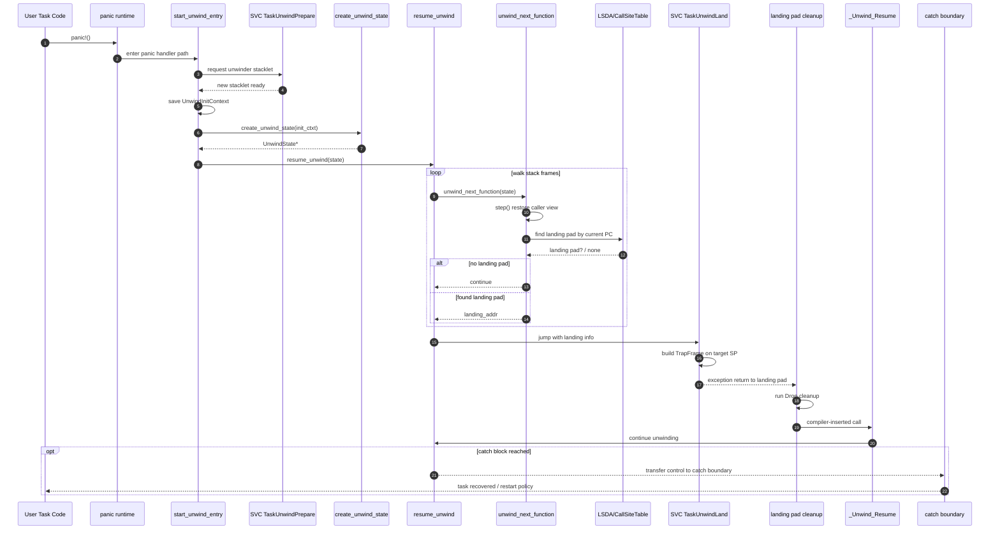

# Hopter Unwind 过程详解

## 0. 为什么需要 Unwind？

Rust 的 panic 机制要求：当程序发生 panic 时，调用栈上所有持有资源（实现了 `Drop` trait）的变量都必须被正确释放。这需要沿调用栈向上回溯，逐一调用 `Drop`，这一过程称为**栈展开（stack unwinding）**。

在标准环境下，Rust 标准库的 panic runtime 会自动完成这一切。但在 Hopter 这样的嵌入式 RTOS 中，没有 std 提供的完整运行时支持，因此需要从零实现整个 unwind 机制。

---

## 1. 编译器留下了什么信息？

编译器在编译每个函数时，会在 ELF 文件中生成专门的 unwind 元数据。不同指令集架构采用了**两套完全不同的体系**：

- **ARM（v6/v7，Cortex-M）**：ARM EHABI，使用 `.ARM.exidx`/`.ARM.extab` 两个专有 section。
- **AArch64（ARMv8-A）**：DWARF CFI，使用标准的 `.eh_frame`/`.eh_frame_hdr` section。

这两套体系的元数据格式、查找方式、指令集均不同，但**语义目标完全一致**：描述如何逐帧恢复寄存器、在哪里执行 cleanup。下面分别介绍。

---

### 1.A ARM EHABI（适用于 Cortex-M / thumbv7em）

### 1.1 `.ARM.exidx`（展开索引表）

- 每个可被展开的函数对应一个 8 字节条目（`ExIdxEntry`）。
- 条目内容：函数地址（prel31 格式）+ 展开信息。
- 所有条目按函数地址排序，运行时可用 PC 做二分查找。
- 条目可直接携带 compact unwind 指令，也可指向 `.ARM.extab`。

对应源码：`hopter/src/unwind/unw_table.rs`

### 1.2 `.ARM.extab`（展开详情表）

- 存放较复杂的展开信息（`ExTabEntry`）。
- 展开指令序列和 LSDA 通常都位于此处。

对应源码：`hopter/src/unwind/unw_table.rs`、`hopter/src/unwind/unw_lsda.rs`

### 1.3 展开指令（Unwind Instructions）

展开指令描述了如何将当前栈帧的寄存器状态恢复为调用者的状态，包括：

- SP 的调整量。
- 需要从栈上弹出的寄存器集合。
- 浮点寄存器的恢复方式。

常见指令语义：

- `DataPop { size }`：`SP += size`
- `RegPop { mask }`：按位图从栈上批量恢复寄存器
- `RegToSp { reg_num }`：将某寄存器的值写回 SP
- `VfpPop`：恢复浮点寄存器

在 Hopter 中，这些指令由 `UnwindState::step()` 负责解释执行。

### 1.4 LSDA（语言特定数据区）

LSDA 描述「当前 PC 所属的 call site 是否关联 landing pad」，其核心结构是 call-site table，每条记录包含：

- 覆盖的指令区间起点和长度。
- `landing_pad` 偏移（0 表示无 landing pad）。
- `action` 索引（区分 cleanup 与 catch 语义）。

运行时流程：给定当前 PC，在 call-site table 中查找覆盖该 PC 的条目，从中读取 landing pad 地址。

为什么不能用“每个函数一个全局符号地址”替代 LSDA？

- 因为同一个函数内部可能有多个 call site，每个 call site 覆盖不同 PC 区间，且对应不同 cleanup 代码块。
- LSDA 提供的是「PC 区间 -> landing pad 偏移」映射；全局符号只能表达「函数 -> 单一地址」。
- 因此，LSDA 的意义是提供函数内精细粒度的异常控制流分派。

在 Hopter 中，LSDA 还有两个实现侧结论：

- Hopter 运行时不“注册”LSDA。LSDA 由 Rust/LLVM 在编译阶段自动写入 `.ARM.extab`，Hopter 只在运行时解析读取。
- 当前 Hopter 主路径按 `call_site_table_entry_for_address()` + `landing_pad_address()` 决定跳转地址；`action_offset` 字段目前没有参与运行时分派逻辑。

---

### 1.B AArch64 DWARF CFI（适用于 ARMv8-A / aarch64）

AArch64 遵循标准 DWARF 异常处理规范（SysV ABI），不使用 ARM EHABI，改用基于 DWARF CFI 的元数据体系。

### 1.5 `.eh_frame`（DWARF CFI 帧描述）

`.eh_frame` 是一个 section，由若干 **CIE**（Common Information Entry，公共信息记录）和 **FDE**（Frame Description Entry，帧描述记录）组成。

**CIE（公共信息记录）**

每个 CIE 被一组函数共享，记录：

- `version`：DWARF 版本号。
- `augmentation`：增强字符串（如 `"zPLR"` 表示携带 personality / LSDA / FDE 指针编码信息）。
- `personality`：personality routine 的地址（如 `__gxx_personality_v0`），负责解析 LSDA、决定是否执行 landing。
- `code_alignment_factor`/`data_alignment_factor`：指令偏移因子。
- 初始 CFI 指令序列：描述函数入口时寄存器的初始规则（如 CFA = SP + 0）。

**FDE（帧描述记录）**

每个函数或代码区间对应一个 FDE，记录：

- `initial_location`：函数起始地址。
- `address_range`：覆盖的字节长度。
- `augmentation_data`：可选，包含该函数的 **LSDA 指针**。
- CFI 指令序列：描述函数执行过程中 CFA（Canonical Frame Address）和各寄存器的变化规则。

对应示例：`aarch64-baremetal-unwind/Cargo.toml`（通过 `unwinding` crate 使用 `.eh_frame`）

### 1.6 `.eh_frame_hdr`（查找索引）

`.eh_frame_hdr` 是 `.eh_frame` 的索引加速结构，包含：

- 指向 `.eh_frame` 起始的指针。
- 一个**按函数地址排序的二分查找表**（FDE 地址数组），格式为 `(initial_location, FDE_offset)` 对。

运行时给定 PC，先在 `.eh_frame_hdr` 中二分查找，定位到对应 FDE，再从 FDE 中读取 CFI 指令和 LSDA 指针。这与 ARM EHABI 中 `.ARM.exidx` 的角色完全对应。

> 在没有 `.eh_frame_hdr` 的场景（bare-metal 或静态链接），展开器退而使用线性扫描 `.eh_frame`。`aarch64-baremetal-unwind` 中使用 `fde-static` feature，即采用此路径。

### 1.7 DWARF CFI 指令

DWARF CFI 指令描述「在当前 PC 处，CFA 和各寄存器应如何从内存/其他寄存器中恢复」。常见指令：

| 指令 | 语义 |
|---|---|
| `DW_CFA_def_cfa reg, offset` | CFA = reg + offset（通常 SP + frame_size） |
| `DW_CFA_def_cfa_offset offset` | 修改 CFA 偏移（SP 增减时调用） |
| `DW_CFA_offset reg, offset` | 寄存器 reg 保存在 CFA - offset 处 |
| `DW_CFA_restore reg` | 恢复寄存器为 CIE 初始规则 |
| `DW_CFA_advance_loc delta` | PC 前进 delta 字节后以下规则生效 |
| `DW_CFA_same_value reg` | 寄存器值与调用方相同（无需恢复） |

AArch64 的 ABI 约定：调用者保存的寄存器对（如 `x29/x30`，即 FP/LR）通常以 `stp x29, x30, [sp, #-16]!` 入栈，CFI 指令相应记录 `DW_CFA_offset x29, -16` 和 `DW_CFA_offset x30, -8`。展开器读取这些规则后，可精确计算每帧的 SP 和 LR，从而向上回溯。

与 ARM EHABI 展开指令的对比：两者都是虚拟机字节码，ARM 的操作对象是「具体寄存器」（直接操作 SP/LR），DWARF 的操作对象是「CFA 规则」（先算出虚拟帧基址 CFA，再从 CFA 推寄存器）。

### 1.8 LSDA 的引用方式（AArch64）

AArch64 的 LSDA 同样是一个 call-site table，结构与 ARM EHABI 基本相同（DW_EH_PE 编码的起点/长度/landing_pad/action），差异在于引用方式：

- **ARM EHABI**：LSDA 数据嵌入在 `.ARM.extab` 条目中，与展开指令连续存放。
- **AArch64 DWARF**：FDE 的 augmentation data 字段中携带一个指针，指向 `.gcc_except_table`（或内联在 `.rodata`）中的 LSDA 结构体。展开器通过 personality routine（如 `__gxx_personality_v0`）解析此指针，再读取 call-site table。

两种方式下 call-site table 的核心语义完全一致，都是「给定 PC，找到对应的 landing pad 偏移」。

---

### 1.9 两种 unwind 元数据体系横向对比

| 维度 | ARM EHABI（Cortex-M） | AArch64 DWARF CFI |
|---|---|---|
| 查找索引 section | `.ARM.exidx` | `.eh_frame_hdr` |
| 详情 section | `.ARM.extab` | `.eh_frame` |
| 查找单元 | `ExIdxEntry`（8 B，prel31） | FDE（可变长，带 CIE 引用） |
| 展开指令格式 | ARM proprietary unwind opcodes | DWARF `DW_CFA_*` 虚拟机指令 |
| CFA 概念 | 无（直接操作 SP/LR） | 有（Canonical Frame Address，先算 CFA 再推寄存器） |
| Compact model | 支持（单 word 内嵌 3 条指令） | 不支持，始终使用完整 FDE |
| LSDA 位置 | 嵌入 `.ARM.extab` | FDE augmentation → `.gcc_except_table` |
| Personality routine | `__aeabi_unwind_cpp_pr0/pr1/pr2` | `__gxx_personality_v0`（可自定义） |
| 寄存器集 | R0–R15（SP=R13, LR=R14, PC=R15）+ 可选 VFP | X0–X30（LR=X30）+ SP（独立）+ SIMD/FP |
| 典型 callee-saved 入栈 | `push {r4-r11, lr}` | `stp x29, x30, [sp, #-N]!` |
| 规范文档 | ARM IHI0038（EHABI） | DWARF5 + Linux SysV ABI |

---

## 2. Landing Pad 是什么？

严格地说，landing pad 是异常处理术语里的**总称**：它指编译器为某个 call site 生成的、在展开到该 call site 时可跳入执行的代码块。这个代码块可能只负责 cleanup，也可能在其中进一步分派到 catch/handler 路径。

本文后续如果不额外说明，**landing pad 默认特指当前帧的 cleanup landing pad**，也就是 unwinder 根据 LSDA call-site table 选中后跳入、用于运行当前帧析构逻辑的那段代码。用户代码中没有对它的任何显式调用——unwinder 通过查询 LSDA call-site table 找到它的地址，再主动跳进去。

几个关键点需要明确：

1. **Landing pad 是可选的**。如果一个函数内没有实现了 `Drop` 的局部变量、也没有 `catch_unwind` 边界，编译器不会为它生成 landing pad。LSDA 中该函数的 call-site entry 的 `landing_pad` 字段为 0，表示「此帧无 landing」。

2. **没有 landing pad 不等于停止执行**。Unwinder 遇到无 landing pad 的帧时，直接执行 `step()` 切换到调用者帧，继续向上查找，**该帧内的任何代码都不会被执行**。「停止」只在一种情况下发生：整个调用栈走完、没有任何 catch 边界，最终触发 unrecoverable 处理（abort/halt）。

3. **Landing pad 有约定入参，但布置入参和执行跳转全部由运行时完成**。对于本文讨论的 cleanup landing pad，编译器做的事情是：在函数体内生成 cleanup 代码块（通常包含 Drop 调用；cleanup 结束后若异常继续传播，则回到 unwinder 继续展开），并把该代码块的地址写进 LSDA。之后的一切都是 Hopter runtime 的工作：
   - `resume_unwind`（Rust）从 LSDA 中读出 `land_addr`，写入 `LandInfo`
   - `start_unwind_entry`（裸汇编）从 `LandInfo` 取出 `land_addr`，发起 `svc TaskUnwindLand`
   - `unwind_land`（Rust）在目标 stacklet 上构造 TrapFrame，把 `land_addr` 写入 `prev_tf.pc`，把 `unw_state_ptr` 写入 `prev_tf.r0`，再将 `ctxt.sp` 指向该 TrapFrame
   - `svc_entry`（裸汇编）执行 `bx lr`（exception return），CPU 从 PSP 弹出 TrapFrame，PC 变为 `land_addr`，r0 变为 `unw_state_ptr`——跳转由 CPU 的 exception return 机制完成，不是显式 `bx`/`bl` 指令

**Landing pad 是编译器与 unwinder 之间的合约**：编译器生成 landing pad 代码并在 LSDA 中记录地址，Hopter runtime 负责找到这个地址并通过 SVC + exception return 将 CPU 引导过去。

**整体逻辑如下（每帧）：**

```
对每一帧：
    ├── 有 cleanup landing pad → unwinder 跳入执行当前帧 cleanup 代码
  └── 没有 landing pad → unwinder step 到调用者帧，当前帧代码完全不执行
```

**Landing pad 的概念在 ARM EHABI 和 AArch64 DWARF 两个体系中完全相同**——差异仅在于「如何查找到它的地址」（前者从 `.ARM.extab` 中 LSDA 读取，后者从 FDE augmentation 指向的 `.gcc_except_table` 读取），landing pad 代码本身的编译方式和执行语义没有区别。

### 2.1 更准确的术语边界

不宜把它简单说成“有两种完全不同的 landing pad 实体”。更准确的说法是：**landing pad 是总称，而 cleanup / catch 是它承担的不同语义角色**。

**1. Cleanup landing pad**

- 负责执行当前帧内局部变量的 `Drop`。
- 对 Hopter 当前这份文档所讨论的“逐帧查 LSDA、跳到目标帧执行”的流程来说，实际命中的就是这类 cleanup landing pad。
- 执行结束后，如果异常还要继续向上传播，则会回到 unwinder 继续展开。

**2. Catch / 恢复边界**

- 对应 `catch_unwind` 这类恢复边界。
- 从概念上说，它是“unwind 在哪里被接住并转入恢复路径”的那一层边界；这是你说的“最终回到的可以继续执行的地方”。
- 在编译器实现里，它当然可能仍然通过异常处理块和相关元数据来实现，但在本文语境下，不应把它和“每一帧的 cleanup landing pad”混为一谈。

Hopter 的任务框架借助 `catch_unwind` 这类恢复边界实现「任务 panic 后可恢复/可重启」的能力；而第 3 节描述的按帧查表、切换栈、跳转执行的核心路径，讲的是 cleanup landing pad。

---

## 3. Hopter Unwind 完整流程（源码对齐）

### 3.1 Panic 触发

panic 发生后，执行流进入 unwind 入口路径，核心入口函数为：

- `hopter/src/unwind/unwind.rs` 中的 `start_unwind_entry`

### 3.2 `start_unwind_entry`：保存初始上下文并切换 unwinder 栈

`start_unwind_entry` 是一段裸汇编函数，执行以下关键步骤：

1. 在 SVC 改写寄存器之前，先将现场关键值暂存至临时寄存器：
   - `r0 ← lr`
   - `r1 ← sp`（panic 发生时的现场 SP）
   - `r2 ← 当前 task 的 stklet boundary`

2. 通过 SVC `TaskUnwindPrepare` 为 unwinder 申请专用 stacklet。

3. 在新 stacklet 上压入 `UnwindInitContext`，包含：
   - `r4–r11`、`lr`、`sp`、`before_unwind_stklet_bound`、`unwinder_stklet_bound`
   - armv7em 下还包含 `d8–d15`（浮点寄存器）

4. 调用 `UnwindState::create_unwind_state(init_ctxt)`。

5. 为 `LandInfo` 预留 16 字节空间，调用 `resume_unwind`。

**这里有一处常见误解需要特别说明：**

- `create_unwind_state` 的参数确实是指向「新 stacklet 上的 `UnwindInitContext`」的指针。
- 但 `UnwindInitContext.sp` 字段保存的是 **panic 发生时的原始 SP**（SVC 前用 `mov r1, sp` 暂存）。
- 因此，`unw_state.gp_regs[SP]` 初始化后指向的是**被展开任务的现场调用栈**，而非 unwinder 自身的专用栈。

### 3.3 新申请 stacklet 里放了什么

以 armv7em 路径为例，新 stacklet 上的栈布局如下：

1. `vpush {d8-d15}`
2. `push {r0-r3}`（包含提前暂存的 `lr`/`sp`/`boundary`）
3. `push {r4-r11}`
4. 以上三步共同构成 `UnwindInitContext`
5. 之后 `add sp, #96` 弹出 init context，但保留 16 字节用于 `LandInfo`

综上，新 stacklet 上的核心对象只有两个：

- `UnwindInitContext`：用于初始化展开状态机
- `LandInfo`：`resume_unwind` 向调用方传递 landing 信息的载体

### 3.4 `UnwindState`：展开状态机

`UnwindState` 维护一份「虚拟寄存器视图」，模拟当前正在被展开的栈帧状态，主要字段如下：

| 字段 | 含义 |
|---|---|
| `gp_regs` | 模拟通用寄存器（R0–R11，含 SP/LR/PC） |
| `dpfp_regs` | 模拟双精度浮点寄存器（D8–D15） |
| `unw_ability` | 当前帧是否可展开，以及对应的展开指令与 LSDA |
| `stklet_boundary` | 当前帧所在的 stacklet 边界 |
| `is_initial` | 是否为首次进入（用于跳过 unwinder 自身的帧） |

展开的本质是：反复执行 `step()`，将当前帧的虚拟寄存器状态变换为调用者帧的状态，逐层向上爬升调用栈。

### 3.5 `step()`：执行展开指令并切帧

`step()` 的执行流程：

1. 取当前帧的 unwind 指令迭代器。
2. 依次解释执行每条指令，更新 `gp_regs`/`dpfp_regs`。
3. 若 PC 未被展开指令显式恢复，则从 LR 中补充。
4. 以新 PC 为索引，查询下一帧的 `unw_ability`。

**特殊路径：跨 stacklet 边界**

当恢复后的 PC 指向 `svc_less_stack` 时，说明当前帧是某 stacklet 的入口函数，此时需要：

- 从 stacklet metadata 中读取 `prev_sp`、`prev_stklet_bound`。
- 将 SP、PC、`stklet_boundary` 切换为上一个 stacklet 对应的值。
- 释放已完成展开的当前 stacklet。

### 3.6 `unwind_next_function()`：向上查找下一个 landing pad

执行逻辑：

1. 非首帧时先调用 `step()` 切到调用者帧。
2. 以当前 PC 查询 LSDA 的 call-site table。
3. 若当前帧有 landing pad，返回其地址；否则继续向上回溯。

### 3.7 `resume_unwind()`：展开主循环

`resume_unwind` 持续调用 `unwind_next_function()`，直到找到一个有效的 landing pad。

找到后，将以下信息写入 `LandInfo` 并返回：

- `UnwindState` 指针
- landing pad 地址
- `gp_regs`/`dpfp_regs` 指针（用于恢复 callee-saved 寄存器）

### 3.8 `TaskUnwindLand`：为何必须通过 SVC 落地

Hopter 使用分段栈（segmented stack），这带来了一个根本矛盾：

- unwinder 运行在自己申请的专用 stacklet 上。
- landing pad 必须在目标函数所在的栈帧上执行。

因此无法直接 `bx` 跳转到 landing pad，必须借助 SVC 在内核态安全完成栈帧切换。

`hopter/src/task/segmented_stack.rs` 中 `unwind_land` 的执行步骤：

1. 从 `tf.r0` 取 `unw_state_ptr`，从 `tf.r1` 取 landing pad 地址。
2. 以 `unw_state.gp_regs[SP]` 为基础，在目标位置构造 `TrapFrame`。
3. 将 `TrapFrame.pc` 设为 landing pad 地址，`TrapFrame.r0` 设为 `unw_state_ptr`。
4. 更新 `ctxt.sp` 与 `ctxt.tls.stklet_bound` 为目标帧对应值。
5. 释放 unwinder 的专用 stacklet。
6. 异常返回（exception return）——CPU 恢复 `TrapFrame` 后直接跳转至 landing pad 执行。

### 3.9 landing pad 执行完后如何继续

cleanup landing pad 执行完本帧所有 `Drop` 后，编译器会自动插入对 `_Unwind_Resume` 的调用，将控制权交还给展开循环，继续处理下一帧，直到：

- 到达 catch 边界并完成恢复，或
- 到达调用栈底部，展开结束。

### 3.10 `unw_catch::catch_unwind` 与 `start_unwind_entry` 的关系

两者不是重复机制，而是同一条链路的上下游：

1. `unw_catch::catch_unwind` 在外层建立恢复边界。
2. 一旦闭包内部 panic，panic handler 进入 `start_unwind_entry`，启动逐帧展开。
3. 展开过程中，若命中的是 cleanup landing pad，则执行 cleanup，并通过 `_Unwind_Resume` 回到 `resume_unwind` 继续向上。
4. 当展开到 catch 边界对应路径时，不再回到 `_Unwind_Resume`，而是进入 catch 回调，最终让外层 `catch_unwind` 返回 `Err(())`。

关键点：

- `resume_unwind` 本身不做“这是 catch/这是 cleanup”的高级语义判断；它负责找到并跳到下一段 landing 代码。
- 真正决定“继续展开还是在此收束”的，是 landing 代码后续是否调用 `_Unwind_Resume`。

### 3.11 为什么看起来有两处“重启”，但不重复

Hopter 的 restartable 任务有两层策略：

1. **并发重启尝试（早期）**：在 `create_unwind_state` 期间，若任务可并发重启，会尝试创建一个 restarted 实例并行运行。
2. **原任务兜底重跑（后期）**：原任务 unwind 完并返回 `restartable_task_entry` 的循环后，若尚未被并发重启，则在本任务上下文里再次执行入口闭包。

避免重复的机制：

- 新实例创建成功时，会把旧任务的 `has_restarted` 置位。
- 旧任务回到 `restartable_task_entry` 后检测到该标志，直接退出，不再二次重启。

因此这是“先并发恢复、失败再兜底”的双层容错，而不是重复实现。

---

## 4. 完整执行链路（文字流程图）

```text
panic!()
  -> start_unwind_entry
      -> SVC TaskUnwindPrepare
      -> 保存 UnwindInitContext
      -> create_unwind_state
      -> resume_unwind loop
          -> unwind_next_function
              -> step（执行 unwind 指令）
              -> 查 LSDA/CallSiteEntry
              -> 找到 landing ?
                    no  -> 继续
                    yes -> 返回 landing
      -> SVC TaskUnwindLand
          -> 构造目标 TrapFrame
          -> 切换到目标 stacklet
          -> exception return
  -> landing pad cleanup
  -> _Unwind_Resume
  -> 回到 resume_unwind
  -> ...直到 catch/结束
```

---

## 5. 关键数据结构关系

```text
.ARM.exidx (按函数地址排序)
  ExIdxEntry
    -> compact unwind instructions
    或
    -> 指向 .ARM.extab

.ARM.extab
  ExTabEntry
    -> unwind instructions
    -> LSDA
        -> CallSiteTable
            -> [start, len, landing_pad, action]
```

运行时以当前 PC 为索引，查询过程分三步：

1. 在 `.ARM.exidx` 中定位函数条目
2. 从 `.ARM.extab` 中取展开指令和 LSDA
3. 在 call-site table 中精确定位 landing pad 地址

---

## 6. AArch64 bare-metal 对比例子

对应目录：`aarch64-baremetal-unwind`

### 6.1 示例实现要点

- `Cargo.toml` 中设置 `panic = "unwind"`。
- `#[panic_handler]` 内调用 `unwinding::panic::begin_panic` 启动展开。
- 在外层任务框架（`task_run`）中使用 `catch_unwind` 建立恢复边界。
- 通过 `DropMarker` 或资源对象验证 cleanup 执行顺序（深帧先、浅帧后）。

相关文件：

- `aarch64-baremetal-unwind/src/main_with_unwinding.rs`（最小化验证）
- `aarch64-baremetal-unwind/src/main.rs`（带 OS 层任务框架的完整演示）
- `aarch64-baremetal-unwind/Cargo.toml`

### 6.2 与 Hopter 的同构关系

两者的底层元数据格式和 runtime 路径不同，但语义目标完全一致：

- Hopter：`.ARM.exidx/.ARM.extab` + 自定义 `UnwindState` 状态机 + `TaskUnwindLand` SVC
- AArch64 示例：`.eh_frame` + `unwinding` crate runtime + `catch_unwind` 恢复边界

语义层面的一致点：

1. panic 后逐帧执行 cleanup，`Drop` 顺序可观测（深帧先、浅帧后）。
2. 执行流最终落回外层恢复边界，系统不崩溃，继续运行。

### 6.3 这个例子能证明什么

该示例可作为「在 AArch64 上实现 Hopter 式恢复语义是可行的」的实证依据：

- 它并非 Hopter 内核路径的一比一移植。
- 但它在 AArch64 bare-metal 环境上验证了同类恢复语义的可落地性，是进一步工程化探索的起点。

---

## 7. 对比总结（Hopter vs AArch64 示例）

| 维度 | Hopter | aarch64-baremetal-unwind |
|---|---|---|
| 元数据 | `.ARM.exidx`/`.ARM.extab` | `.eh_frame` |
| 展开驱动 | 自定义 `UnwindState::step` | `unwinding` crate/runtime |
| 栈模型 | segmented stack | 连续栈（示例） |
| 落地机制 | SVC `TaskUnwindLand` | runtime 控制流迁移 |
| 恢复边界 | task 框架 catch | `catch_unwind(task_run)` |

---

## 8. 预测分析：Linux kernel module（面向内核线程）

### 8.1 现实约束

- 内核现有的 unwind 机制（如 ORC）主要服务于回溯诊断，并非语言级 cleanup landing pad 的执行器。
- Linux 主线内核没有提供类似用户态 panic runtime 那样可直接用于「panic-cleanup-recover」的通用机制。
- 此外，内核特有的语义约束（spinlock、RCU read-side section、中断上下文等）对执行路径有严格限制，强行插入自动化 cleanup 极易破坏时序假设。

### 8.2 可行工程方案

建议采用「逻辑 unwind」（显式 cleanup 框架）而非直接套用 ABI unwind：

1. 为内核线程入口设置统一包装（`kthread_wrapper`）。
2. 在 wrapper 内维护 cleanup 栈，每次资源申请时同步注册对应的释放动作。
3. 发生 fatal 错误时按逆序执行 cleanup 栈。
4. 根据策略决定恢复方式：重启线程、降级运行或安全退出。

### 8.3 结论

- 在 Linux kernel module 场景下，工程目标应是「获得恢复语义」，而非强求与用户态完全相同的 ABI 级展开路径。
- Hopter 的核心思想——明确恢复边界、可证明的分层清理、故障隔离后系统继续运行——在此场景同样适用，只是实现手段需因地制宜。

---

## 9. 预测分析：seL4 微内核（作为设备驱动组件）

### 9.1 为什么 seL4 场景更适合落地

seL4 的系统结构在以下几个维度上天然契合 Hopter 的设计思路：

- 驱动以用户态组件形式运行，与内核及其他组件天然隔离。
- IPC 边界清晰，可作为定义恢复点的自然位置。
- capability 资源模型使资源所有权明确，便于在恢复路径上做确定性回收。

### 9.2 建议架构

1. `driver_main_loop` 外层设置恢复边界（`catch_unwind` 或等价 guard）。
2. 每个请求处理函数（中断事件、IPC 命令）内部按层注册 cleanup。
3. 请求失败时执行 cleanup，向调用方返回错误 IPC 响应。
4. 当错误扩散至组件边界时，由 supervisor 发起组件级重启。

### 9.3 主要风险

- **硬件状态漂移**：cleanup 成功清理了内存对象，但设备寄存器状态未复位，导致软硬件不一致。
- **幂等性问题**：请求被部分执行后触发恢复，重放时可能产生副作用。
- **并发二次释放**：中断与线程处理路径并发时，同一资源可能被释放两次。

---

## 10. 时序图（Hopter unwind 主路径）



---

## 11. 小结

- Hopter unwind 的核心难点不在于展开指令本身的解释执行，而在于**分段栈场景下如何通过 SVC 将执行流安全切换到正确的 landing pad**。
- `aarch64-baremetal-unwind` 实证了：在 AArch64 bare-metal 上同类恢复语义完全可以落地，底层元数据格式的差异（`exidx/extab` vs `.eh_frame`）不影响语义目标的实现。
- 面向 Linux kernel module 与 seL4 的工程实践，关键是抓住两个本质：**明确的恢复边界**和**可证明的分层清理**，而不是将完整的 ABI unwind 路径照搬到新环境中。

---

## 12. 讨论补充（FAQ）

### 12.1 `start_unwind_entry` 是循环吗？

不是。`start_unwind_entry` 是一次性入口，职责是：保存初始上下文、创建 `UnwindState`、调用一次 `resume_unwind`，再跳到本轮选出的 landing pad。

真正的循环在 `resume_unwind` 内部：它反复调用 `unwind_next_function`，直到找到下一段可执行的 landing pad 为止。

### 12.2 `bx r1` 最终跳到哪里？

`bx r1` 跳到的是本轮 unwinder 根据当前 PC 和 LSDA 查出来的 `land_addr`，不是固定跳到某个命名函数。

- 命中 cleanup landing pad：执行本帧 cleanup，末尾通常调用 `_Unwind_Resume` 继续展开。
- 命中 catch 边界对应路径：进入 catch 处理，不再回到 `_Unwind_Resume` 链。

### 12.3 `svc TaskUnwindLand` 之后还会执行下面的 `ldr sp` 和 `bx r1` 吗？

通常不会（线程上下文路径）。

原因是 `TaskUnwindLand` 在 SVC 中会改写任务 trap frame 的 `pc/sp`，SVC 退出时通过 exception return 直接回到 landing pad 执行，而不是回到 SVC 下一条普通指令。

只有 ISR 分支会跳过该 SVC，这时才会执行后续本地的 `ldr sp` + `bx r1`。

### 12.4 为什么看起来每次 `_Unwind_Resume` 都要走 SVC？

因为 `_Unwind_Resume` 再次进入 unwinder 时，需要重新准备 unwinder 自己的执行栈（专用 stacklet），并在返回 landing 前由内核统一完成落地切换。

注意：不是把 landing pad 放在 unwinder 栈上执行。landing pad 仍在目标任务栈帧上执行；新申请的栈是给 unwinder 运行 `resume_unwind/unwind_next_function` 这段逻辑使用。

另外，ISR 上下文下会跳过 SVC 路径，不是无条件每次都发 SVC。

### 12.5 这里说的 unwinder，具体指哪段执行流？

在 Hopter 里，unwinder 指以下协作链路：

1. `panic_handler -> start_unwind_entry`
2. `create_unwind_state`
3. `resume_unwind`（主循环）
4. `unwind_next_function`（逐帧 `step` + LSDA 查表）
5. `TaskUnwindLand`（把控制流落到 `land_addr`）
6. cleanup 完成后 `_Unwind_Resume` 回到第 3 步

### 12.6 不使用 `catch_unwind` 时，默认 landing pad 在做什么？

默认 landing pad 主要做 cleanup（执行 `Drop`）。cleanup 结束后调用 `_Unwind_Resume` 继续向上展开。

也就是说，默认行为是“清理并继续传播”，不是“吞掉 panic”。只有 catch 边界会终止继续上抛。
