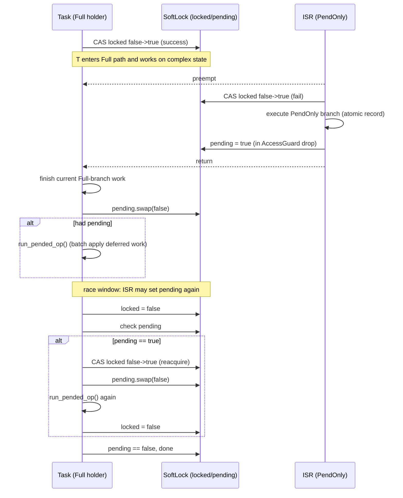

# Hopter Soft-Lock 的固定功能整理

这份文档回答两个核心问题：

1. Soft-Lock 是否在执行固定功能
2. 为什么 Full 路径和 defer 路径看起来都在做同一件事，但仍然分开实现

## 一、结论先说

是的，Soft-Lock 的执行框架是固定的，和传统锁有本质区别。

传统锁的思路是：抢不到锁就等待执行流继续。
Soft-Lock 的思路是：抢不到 Full 访问时不等待执行流，而是记录意图，稍后由 Full 持有者补做。

所以它不是挂起线程，而是挂起工作内容。

## 二、Soft-Lock 的固定框架（所有实例共通）

在 sync/soft_lock.rs 中，固定流程是：

1. 访问分流
- with_access 尝试获取 Full。
- 成功则进入 Access::Full。
- 失败则进入 Access::PendOnly。

2. PendOnly 侧只做可并发安全的记录
- PendOnly 分支只能做原子或 lock-free 的记录动作。
- 不能做复杂共享状态修改。

3. Drop 时统一补做
- 如果当前持有的是 Full，AccessGuard::drop 会检查 pending 标志。
- 只要发现有 pending，就调用 run_pended_op 补做。
- 补做期间若又有 ISR 记录了新的 pending，会继续循环，直到没有遗漏。

4. PendOnly 退出时置 pending
- 如果当前持有的是 PendOnly，AccessGuard::drop 会把 pending 置为 true。
- 这保证 Full 持有者后续一定会补做。

这四步是 Soft-Lock 的固定骨架。

## 三、为什么说是“固定功能”

固定的是机制，不是业务数据结构本身。

每个实例都要实现三件事：

1. FullAccessor
- 允许执行完整业务操作。

2. PendOnlyAccessor
- 只暴露可安全记录意图的字段。

3. run_pended_op
- 把 PendOnly 记录的内容，按该实例语义补做成真正业务操作。

也就是说：
- 机制固定：分流、记录、置 pending、Drop 补做。
- 语义可定制：记录什么、如何补做，由各实例定义。

## 四、三个真实例子

### 1) Scheduler ReadyQueue

Full 路径（insert_task_to_ready_queue 中 Access::Full）
- 检查是否应抢占。
- task.set_state(Ready)。
- push 到 ready_linked_list。

PendOnly 路径（Access::PendOnly）
- 只做 insert_buffer.enqueue(task)。

run_pended_op
- while dequeue insert_buffer:
  - 检查是否应抢占
  - set_state(Ready)
  - push 到 ready_linked_list

观察：
- Full 处理当前 1 个 task。
- run_pended_op 批量处理之前挂起的多个 task。
- 核心业务动作相同，输入来源不同。

### 2) Mailbox

Full 路径（notify_allow_isr 中 Access::Full）
- 有等待任务则直接唤醒。
- 无等待任务则 count += 1。

PendOnly 路径（Access::PendOnly）
- pending_count += 1。

run_pended_op
- 把 pending_count 原子搬运到 count。
- 如果有等待任务，按语义执行唤醒并消耗计数。

观察：
- PendOnly 只记录“有通知发生”。
- run_pended_op 把通知真正兑现到 wait_task/count。

### 3) WaitQueue

Full 路径（notify_one_allow_isr 中 Access::Full）
- 直接从 queue 弹一个最高优先级任务并唤醒。

PendOnly 路径（Access::PendOnly）
- notify_cnt += 1。

run_pended_op
- cnt = notify_cnt.swap(0)
- 循环 cnt 次弹任务并唤醒

观察：
- PendOnly 只记录“需要通知几次”。
- run_pended_op 真正执行队列弹出与唤醒。

## 五、为什么 Full 和 defer 看起来同一件事，还要分开

本质动作常常一样，但必须分开，原因是输入与时机不同：

1. 输入不同
- Full: 当前调用这一次带来的输入（通常是单个）。
- defer: 之前并发上下文累积的输入（通常是批量）。

2. 时机不同
- Full: 现在就能安全完成。
- defer: 当时不能安全完成，只能登记，稍后补做。

3. 能力不同
- PendOnly 访问能力受限，只能做原子记录。
- Full 才有权限操作复杂共享状态（例如 wait_task、链表、队列节点）。

因此代码上会看到“动作类似但路径分离”：
- Full 分支处理即时请求。
- run_pended_op 处理积压请求。

## 六、与传统锁的关键差异

传统锁：抢不到锁时，执行流等待。
Soft-Lock：抢不到 Full 时，执行流不等待，记录待办并快速返回。

所以 Soft-Lock 不是 mutex/spinlock 的直接替代，而是“中断友好的 deferred-work 并发模型”。

## 七、一句话总结

Soft-Lock 的固定功能是：
- 访问分流（Full 或 PendOnly）
- PendOnly 只记录意图
- Full 在 Drop 阶段通过 run_pended_op 兜底补做直到无遗漏

业务动作可以看起来相同，但因为输入来源、执行时机、访问权限不同，必须分路径实现。

## 八、统一时序图（一次 ISR 抢占 + Full 释放补做）

下面这张图对应 soft-lock 的固定执行框架：ISR 不阻塞，只记录；Full 持有者在 drop 阶段补做并兜底到无遗漏。

